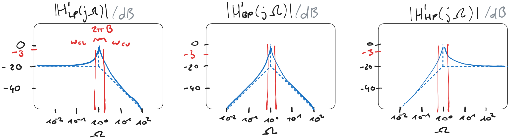

---
tags:
aliases:
keywords:
subject:
  - VL
  - Elektrotechnik
semester: SS24
created: 2. Juli 2024
professor:
title: Bandbreite
---
 
# Bandbreite

Die $3\mathrm{dB}$ Bandbreite ist definiert als

$$
B=\frac{\omega_{\mathrm{cu}}-\omega_{\mathrm{cl}}}{2 \pi}=f_{\mathrm{cu}}-f_{\mathrm{cl}}
$$
- $f_{\mathrm{cu}}$ ... Obere Grenzfrequenz (Upper Corner Frequency)
- $f_{\mathrm{cl}}$ ... Untere Grenzfrequenz (Lower Corner Frequency)

Zusammenhang mit der Güte

$$
B=\frac{\omega_{\mathrm{r}}}{2 \pi Q}=\frac{f_{\mathrm{r}}}{Q}
$$
$\Rightarrow$ Je größer bei fester Resonanzfrequenz $f_{\mathrm{r}}$ die [Güte](Güte.md) $Q$ eines Schwingkreises, desto kleiner ist seine Bandbreite

- Eine große Güte führt also zu einem steil-flankigen Frequenzverhalten des Stroms bei einem Serienschwingkreis mit Spannungsspeisung

## Bandbreite bei Filtern

Diese definition der Bandbreite gilt auch für Filter 2. Ordnunung

%%[🖋 Edit in Excalidraw](../../_assets/Excalidraw/Q-B-Filter-2O.md)%%