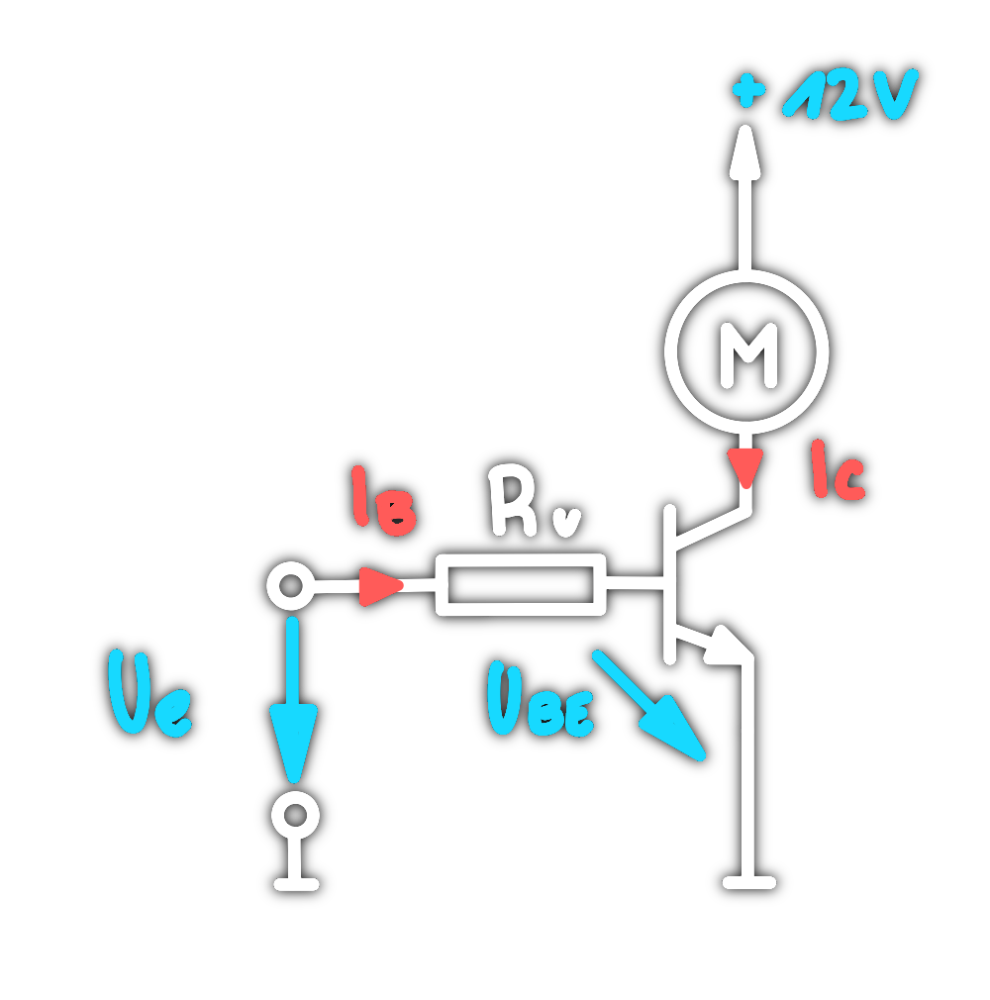
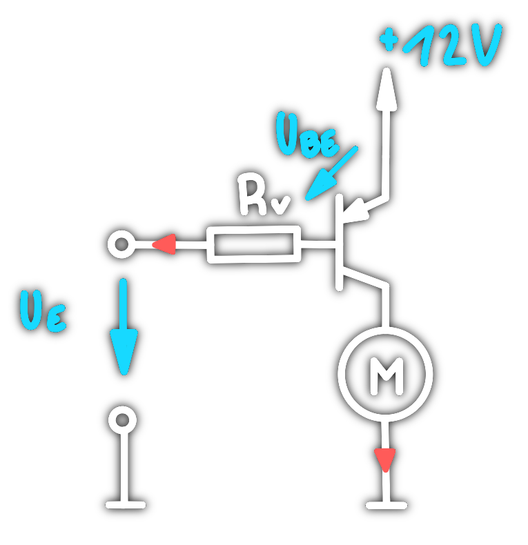

# Bipolartransistor als Schalter

|                      NPN                      |                      PNP                      |
| :-------------------------------------------: | :-------------------------------------------: |
|  |  |

---

- [Transistor_als_Schalter_intro](../../_assets/pdf/Transistor_als_Schalter_intro.pdf)