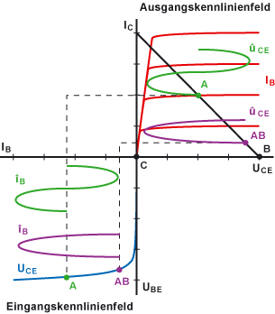

---
tags:
aliases:
  - BJT als Endstufe
subject:
  - VL
  - Einführung Elektronik
semester: WS24
created: 9th December 2025
professor:
release: false
title: BJT als Verstärker
---

# Bipolartransistor als Verstärker / Endstufe

| Betriebsarten                                                                                                      | Kennlinie                                       |
| ------------------------------------------------------------------------------------------------------------------ | ----------------------------------------------- |
| [A-Betrieb](A-Betrieb.md) [B-Betrieb](B-Betrieb.md) [AB-Betrieb](AB-Betrieb.md) [C-Betrieb](C-Betrieb.md) |  |

---

- [Wikipedia - Endstufe](https://de.wikipedia.org/wiki/Endstufe)