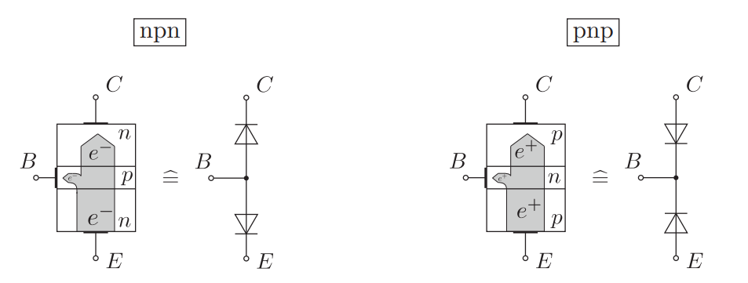
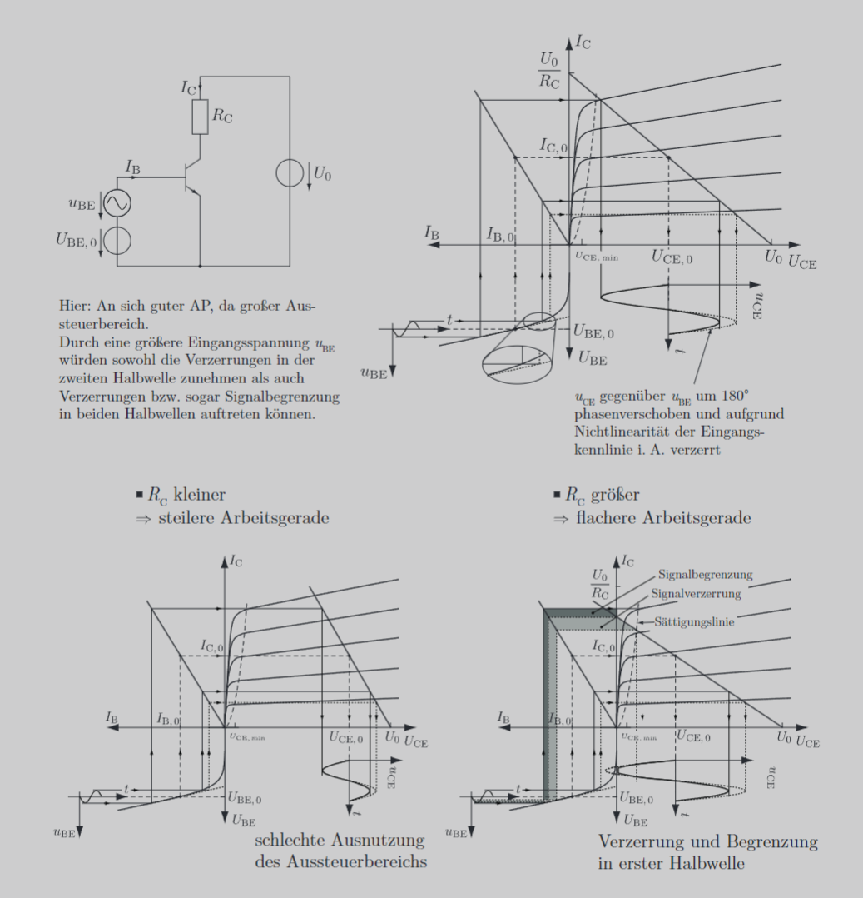

---
tags:
  - Halbleiter/BJT
aliases:
  - Bipolartransistor
  - Bipolar Transistor
  - BJT
  - bipolar junction transistor
subject:
  - Einführung Elektronik
  - VL
created: 24th March 2022
semester: WS24
professor:
  - Christian Diskus
  - Bernhard Jakoby
  - Siegbert Schrempf
  - Michael Offenhuber
release: false
---

# Bipolar-Junction-Transistor

> weitergeleitet von [Transistor](Transistor.md)

| Schaltung                                    | [Emitterschaltung](Emitterschaltung.md)                      | [Basisschaltung](Basisschaltung.md)              | [Kollektorschaltung](Emitterfolger.md)              |
| :------------------------------------------- | :---------------------------------------------------------- | :-------------------------------------------------- | :-------------------------------------------------- |
| Eingangswiderstand $\mathrm{r}_{\mathrm{e}}$ | $100 \Omega \ldots 10 \mathrm{k} \Omega$                    | $10 \Omega \ldots 100 \Omega$                       | $10 \mathrm{k} \Omega \ldots 100 \mathrm{k} \Omega$ |
| Ausgangswiderstand $\mathrm{r}_{\mathrm{a}}$ | $1 \mathrm{k} \Omega \ldots 10 \mathrm{k} \Omega$           | $10 \mathrm{k} \Omega \ldots 100 \mathrm{k} \Omega$ | $10 \Omega \ldots 100 \Omega$                       |
| Spannungsverstärkung $V_{\mathrm{u}}$        | $20 \ldots 100$ fach                                        | $100 \ldots 1000$ fach                              | $\leq1$                                             |
| Gleichstromverstärkung $B$                   | $10 \ldots 50$ fach                                         | $\leq1$                                             | $10 \ldots 4000$ fach                               |
| Phasendrehung                                | $180^{\circ}$                                               | $0^{\circ}$                                         | $0^{\circ}$                                         |
| Temperaturabhängigkeit                       | groß                                                        | klein                                               | klein                                               |
| Leistungsverstärkung $V_{\mathrm{p}}$        | sehr groß                                                   | mittel                                              | klein                                               |
| Grenzfrequenz $\mathrm{f}_{\mathrm{g}}$      | niedrig                                                     | hoch                                                | niedrig                                             |
| Anwendungen                                  | NF- und HF -Verstärker <br>Leistungsverstärker <br>Schalter | HF -Verstärker                                      | Anpassungsstufen<br>Impedanzwandler                 |

## Aufbau

Ein Bipolartransistor besteht aus zwei gegeneinander geschalteten $p n$-Übergängen ([Dioden](Diode.md)) mit einer gemeinsamen, sehr kleinen ( $p$ oder $n$ ) Zone in der Mitte, der sogenannten Basis $(B)$. Die beiden anderen Zonen heißen Kollektor $(C)$ und Emitter $(E)$. Im regulären Betrieb (Durchlassbetrieb) wird die $B E$-Diode in Durchlass-, die $B C$-Diode in Sperrrichtung betrieben.



Prinzipdarstellungen eines $npn$- und $p n p$-Bipolartransistors (Elektronen bzw. Löcherstromrichtung).

> [!warning] Die Diodendarstellung dient nur als Gedankenmodell. Ein Transistor kann nicht diskret aus zwei Dioden aufgebaut werden.

### Verstärkungseffekt

- Bei leitender $B E$-Diode wird die Basis mit Elektronen **überschwemmt**, die in die Raumladungszone (RLZ) der gesperrten $B C$-Diode gelangen.
- Durch das durch $U_{\mathrm{CE}}$ hervorgerufene [E-Feld](../../Elektrotechnik/Elektrisches%20Feld.md) wird der Hauptanteil dieser Elektronen Richtung Kollektor **abgesaugt**.

> [!warning] Zu beachten ist:
> - Der Effekt tritt nur bei in **Flussrichtung** vorgespannter $BE$-Diode sowie in **Sperrrichtung** betriebener $B C$-Diode auf.
> - $I_{\mathrm{C}}$ wird hauptsächlich von $U_{\mathrm{BE}}$ und nicht von $U_{\mathrm{CE}}$ bestimmt!
> - $U_{\mathrm{CE}}$ muss nur die minimale Spannung $U_{\mathrm{CE}, \min }$ überschreiten, ab der die Ladungsträger abtransportiert werden.
> 
> Der Elektronenstrom der in Durchlassrichtung betriebenen $B E$-Diode wird praktisch fast komplett in den Kollektor transferiert. (Nur ein kleiner Teil gelangt in die Basis.)
>  > [!success] Für den pnp-Transistor gelten entsprechend umgekehrte Verhältnisse.

## Kennlinie

Die Transferkennlinie wird durch die [Shockley Gleichung](Shockley%20Gleichung.md) beschrieben:
$$
\begin{align}
I_{\mathrm{C}}&=I_{\mathrm{S}}\left(e^{\frac{U_{\mathrm{BE}}}{\mathrm{U}_{\mathrm{T}}}}-1\right) \\
I_{\mathrm{B}}&=\frac{I_{\mathrm{C}}}{B} \\
I_{\mathrm{E}}&=I_{\mathrm{B}}+I_{\mathrm{C}}
\end{align}
$$

### 4-Quadranten Kennlinienfeld


## Arbeitspunkteinstellung

Durch die Dimensionierung der Beschaltung wird der Arbeitspunkt der Transistorschaltung eingestellt.

Der Arbeitspunkt
- legt die Großsignalgrößen $I_{\mathrm{B}, 0}, U_{\mathrm{BE}, 0}, I_{\mathrm{C}, 0}$ und $U_{\mathrm{CE}, 0}$ sowie die
- [[BJT Kleinsignalverhalten]] $r_{\mathrm{BE}}, S$ und $g_{\mathrm{EA}}$ fest,
- bestimmt den maximal möglichen Aussteuerbereich,
- soll für große Aussteueramplituden in die Mitte des Aussteuerbereiches $\left(U_{\mathrm{CE}, \min } \ldots U_0\right)$ gelegt werden.



### Temparatur und Verstärkungsabweichungen

Üblicherweise möchte man durch die Beschaltung des BJT die Einstellung eines bestimmten Kollektorstromes erzielen. Hierbei treten zwei Probleme auf:

- Es kann nicht sichergestellt werden, dass selbst vom selben Transistortypen die Verstärkung immer die gleiche ist. $\to$ statische Abweichung von $B$
- Durch die Shockleygleichung ist eine gewisse Temparaturabhängigkeit (empfindlichkeit) gegeben.

Alternativ kann auch das Kollektorpotential über einen Widerstand einen Basisstrom erzeugen, welcher sich bei Vergrößerung des Kollektorstromes und daher Absinken des Kollektorpotentials verringert. Es handelt sich dabei also um eine spannungsgesteuerte Stromgegenkopplung, oft fälschlicherweise Spannungsgegenkopplung genannt.

Nun gibt es zwei Einstellungen um jeweils eines dieser Probleme zu lösen:

> [!important] [[Stromeinstellung]]: Transistor mit Basisvorwiderstand
> $I_{B}$ wird eingeprägt (ist *Konstant*)
> - Beseitigt Temparaturinstabilität ✅
> - Empfindlich gegenüber Verstärkungsabweichungen ❌
> 
> > [!info] **Weiterführend**: AP-Einstellung mit Spannungsgesteuerte Stromgegenkopplung

> [!important] [[Spannungseinstellung]]: Transistor mit Basisspannungsteiler
> $U_{BE}$ wird eingeprägt (Muss daher genau dem DB entnommen werden. Annahme $\approx 0.7 V$ unzulässig)
> - Unempfindlich gegenüber Verstärkungsabweichungen ✅
> - Temparatur instabil ❌
> - Instabil gegenüber ungenaue Dimensionierung: Spannung muss **genauest möglich** stimmen ❌
>  
> > [!info] **Weiterführend**: AP Einstellung mit Stromgesteuerte Spannungsgegenkopplung

```tikz
\usepackage[european, straightvoltages]{circuitikz}
\usepackage{amsmath}

\begin{document}
\begin{circuitikz}[thick]
% Begin Schematic

\end{circuitikz}
\end{document}
```


Funktionen der Arbeitsgeraden
$$
I_{\mathrm{B}}=\frac{U_{\mathrm{L}}-U_{\mathrm{BE}}}{R_{\mathrm{i}}} \quad I_{\mathrm{C}}=B \cdot \frac{U_{\mathrm{L}}-U_{\mathrm{BE}}}{R_{\mathrm{i}}}
$$


## Kleinsignalverhalten

 
> [!warning] Kleinsignalgrößen hängen vom Arbeitspunkt ab.
> Um Die Kleinsignalgrößen nutzen zu können, wird die Transistorgleichung am **Arbeitspunkt** linearisiert. 

- [Kleinsignalverhalten](BJT%20Kleinsignalverhalten.md) des BJT

## Betriebsparameter

- [Betriebsparameter](../Betriebsparameter.md) von Verstärkern

## Betriebsarten

- [BJT als Schalter](BJT%20als%20Schalter.md)
    - [BJT-Kippschaltung](../Oszillatoren/Kippstufe.md#BJT-Kippschaltung)
- [BJT als Verstärker](BJT%20als%20Verstärker.md)
- [BJT als Konstantstromquelle](BJT%20als%20Konstantstromquelle.md)
    - [Stromspiegel](../Stromversorgungseinheiten/Stromspiegel.md)

---

# Referenz

- [EK - BJT Betriebsarten](https://www.elektronik-kompendium.de/sites/slt/0303311.htm)
- [EK - Transistorstromquellen mit Silizium-Dioden](https://www.elektronik-kompendium.de/public/schaerer/currled.htm)
- [EK - Konstantstromzweipol](https://www.elektronik-kompendium.de/public/schaerer/curr2pol.htm)
- [EK - Stromspiegel](https://www.elektronik-kompendium.de/public/schaerer/currmr.htm)