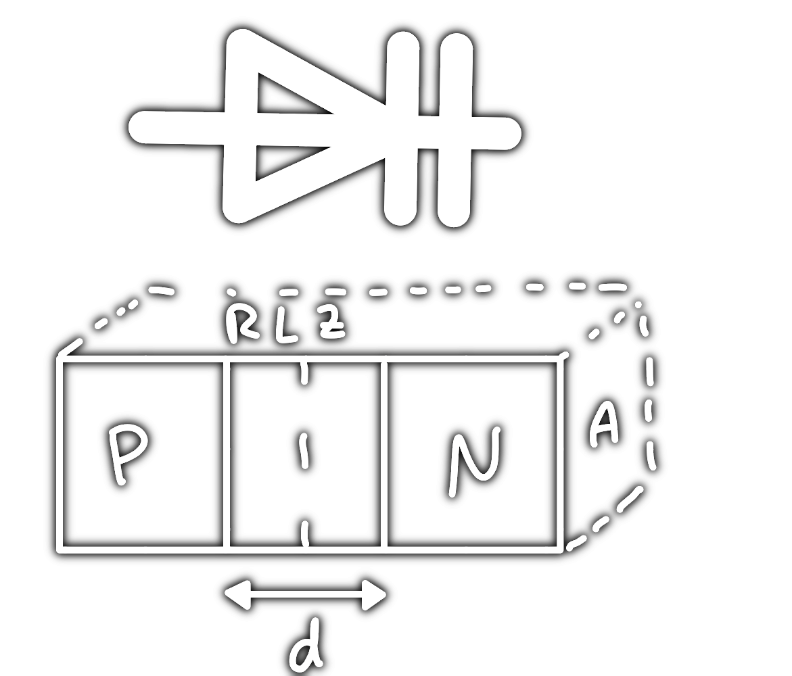

---
tags:
  - Halbleiter/Diode
aliases:
  - Varicap
  - Varaktor
  - Abstimmdiode
subject:
  - hwe
created: 19th January 2023
---

# Kapazitäts-Diode

> [!question] [Diode](Diode.md)

- Mit der Kapazitätsdiode lassen sich elektrisch steuerbare Kapazität realisieren.
- Durch Änderung der angelegten Spannung lässt sich eine Variation der [Kapazität](../../Elektrotechnik/Kapazität.md) von 10:1 erreichen.  
- Durch geeignete Dotierung können Kapazitäten im Bereich von 3 pF bis 300 pF erreicht werden.

$d = f(U)$  
Die Breite der RLZ ist eine Funktion der Spannung.

>[!summary] $C=\dfrac{\varepsilon\cdot A}{d(U)}$

## Funktionsweise

Die RLZ (sperrschicht) stellt isolator an der Grenzfläche von $n$ nach $p$ her. Das elektrische Ausgleichsfeld verdrängt die Ladungsträger an diese Grenzflächen, und sie sammeln sich dort an.

- Mit steigender Spannung vergrößert sich die Breite der ladungsfreien Zone, damit nimmt die Kapazität ab.

# Tags

- [VCO](../Oszillatoren/Voltage%20Controlled%20Oscillator.md)  
- [PLL](../Oszillatoren/Phase%20Locked%20Loop.md)