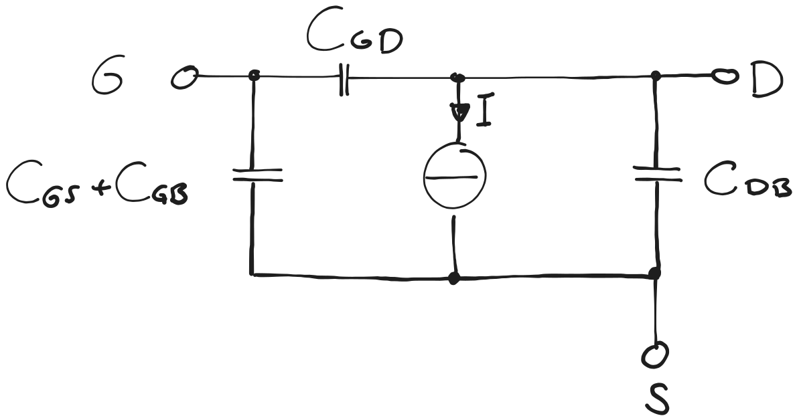

---
tags:
aliases:
subject:
  - KV
  - Analoge Schaltungstechnik
semester: WS25
created: 26th February 2026
professor:
release: false
title: MOSFET Großsignal ESB
---

# Großsignal ESB

Gesteuerte Stromquelle $I_{\mathrm{DS}}=f(W,L,V_{\mathrm{GS}},V_{\mathrm{DS}},V_{\mathrm{SB}})$ mit Parasitären Kapazitäten, die ebenfalls abhängig von der Geometrie sind.

- Stromquelle $I_{D}$ Modelliert den Stromfluss zwischen Drain und Source
- Gesteuert über die 3 Steuerspannungen: $V_{\mathrm{GS}}$, $V_{\mathrm{DS}}$, $V_{\mathrm{SB}}$

Man beachtet $I_{D} = f(V_{GS})$ wodurch auch ein gesteuerter Widerstand modelliert werden kann.

Im Fall dass Bulk (B) mit Source (S) verbunden wird:

%%[🖋 Edit in Excalidraw](../../_assets/MOSFET-GSESB-Simple.md)%%