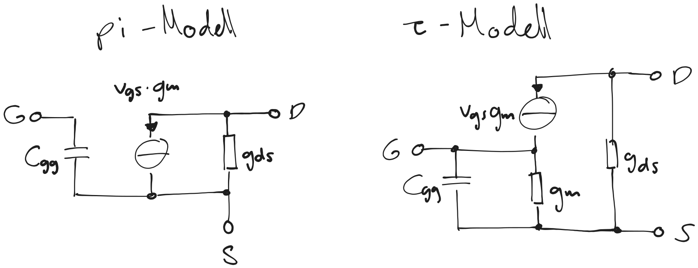
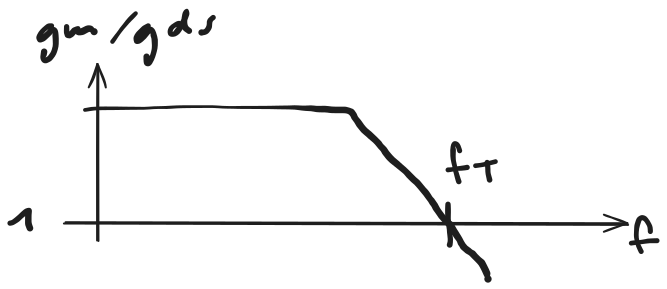

---
tags:
aliases:
subject:
  - KV
  - Analoge Schaltungstechnik
semester: WS25
created: 26th February 2026
professor:
release: false
title: MOSFET Kleinsignal ESB
---

# MOSFET Kleinsignal ESB

- Allgemein Nichtlineares Modell
- Linearisierung um den DC Arbeitspunkt

%%[🖋 Edit in Excalidraw](../../_assets/MOSFET-KSESB.md)%%

- $C_{\mathrm{gg}}$ ... Eingangskapazität $C_{\mathrm{gs}}+C_{\mathrm{gd}}+C_{\mathrm{gb}}$

> [!info] **Transkonduktanz** $g_{\mathrm{m}} = \dfrac{ \partial I_{\mathrm{D}} }{ \partial V_{\mathrm{GS}} }$
> 
> - Beschriebt, wie der Drainstrom mit der Gate-Source Spannung anstiegt.
> - Er repräsentiert die Verstärkungsfähigkeit des Transistors

> [!info] **Ausgangsleitwert** $g_{\mathrm{ds}} = \dfrac{ \partial I_\mathrm{D} }{ \partial V_{\mathrm{DS}} }= \dfrac{1}{r_{\mathrm{out}}}$
> 
> - Änderung des Drainstroms mit der Gate-Source Spannung
> - Idealerweise 0 im **Sättigungsbereich** (Steilheit der Stromquelle)
> - Im **Triode-Betrieb** gleich dem mit $V_{\mathrm{GS}}$ eingestellten Widerstand

> [!info] **Transitfrequenz** $f_{\mathrm{T}}$
>
> Frequenz, bei der der Transistor auf eine Verstärkung von genau 1 Abfällt
>
> 
> %%[🖋 Edit in Excalidraw](../../_assets/MOSFET-FT.md)%%
>
> $$
> f_{\mathrm{T}} \approx \frac{g_{\mathrm{m}}}{2\pi C_{\mathrm{gg}}} = \frac{g_{\mathrm{m}}}{2\pi (C_{\mathrm{gs}} + C_{\mathrm{gd}} + C_{\mathrm{gb}}) }
> $$
> 
> Ein hohes $f_{\mathrm{T}}$ bedeuted
> 
> - Schnelleres Schalten
> - Höhere mögliche Bandbreite
> - Bessere RF performance
> 
> | $f_{\mathrm{T}}$ erhöht sich mit: | |  $f_{\mathrm{T}}$ verringert sich mit |
> | - | - | - |
> | höheres $g_{\mathrm{m}}$ | | größeren Parasitären Kapazitäten |
> | $\iff$ Höherer Biasstrom oder größeres $\frac{W}{L}$ | | $\iff$ größere Flächen |