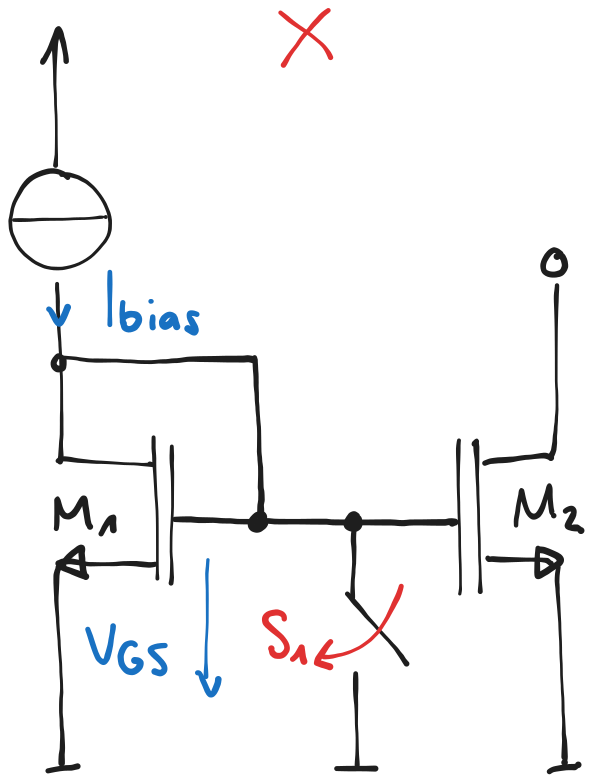
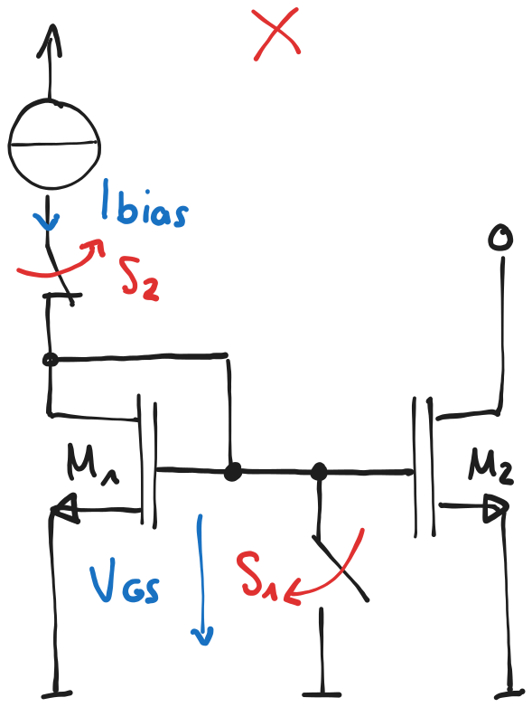
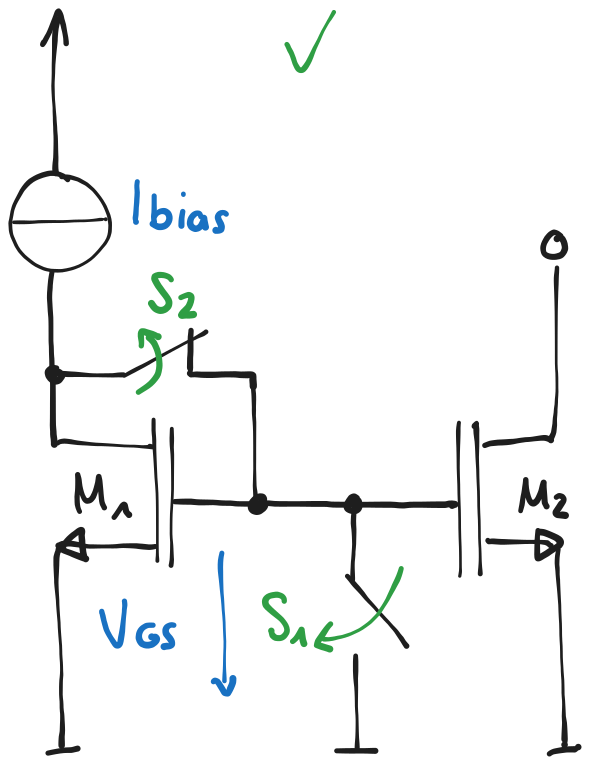

---
tags:
aliases:
subject:
  - KV
  - Analoge Schaltungstechnik
semester: WS25
created: 27th February 2026
professor:
release: false
title: MOSFET Stromspiegel
---

# MOSFET Stromspiegel

%%[🖋 Edit in Excalidraw](../../_assets/Excalidraw/MOSFET%20Stromspiegel%202026-02-27%2018.36.05.excalidraw.md)%%

## Abschaltung eines Stromspiegels

>[!success] Möglichst schnell alle **Knoten** auf ein **definiertes Potenzial** bringen

|                  |  |                               |                        |
| ---------------- | ----------------------------------------------------------------------- | ---------------------------------------------------------------------------------------------------- | --------------------------------------------------------------------------------------------- |
| Zum ausschalten: | $S_{1}$ schließen ($V_{\mathrm{GS}}=0$)                                 | $S_{1}$ schließen ($V_{\mathrm{GS}}=0$) $S_{2}$ öffnen ($I_{\mathrm{bias}}=0$)                    | $S_{1}$ schließen ($V_{\mathrm{GS}}=0$),  $S_{2}$ öffnen ($I_{\mathrm{bias}}=0$)           |
| Verhalten        | Stromquellenstrom fließt weiterhin. (Unnötiger Verbrauch) ❌             | Im Betrieb verursacht der Schalter $S_{2}$ (wieder ein MOSFET) einen unerwünschten Spannungsabfall ❌ | Die Verbindung $V_{\mathrm{DS}} = V_{\mathrm{GS}}$ wird aufgetrennt, sodass $M_{1}$ sperrt. ✅ |

%%[🖋 Edit in Excalidraw](../../_assets/Excalidraw/MOSFET-curr-mirr-off1.md)%%
%%[🖋 Edit in Excalidraw](../../_assets/Excalidraw/MOSFET-curr-mirr-off2.md)%%
%%[🖋 Edit in Excalidraw](../../_assets/Excalidraw/MOSFET-curr-mirr-off3.md)%%