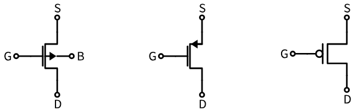
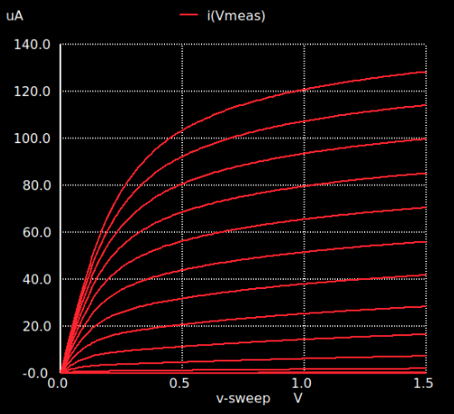
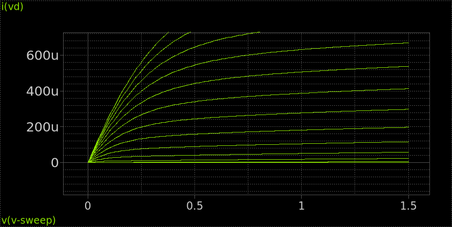

---
tags:
aliases:
  - Metall-Oxid-Halbleiter-Feldeffekttransistor
keywords:
subject:
  - KV
  - Analoge Schaltungstechnik
  - VL
  - Technische Elektronik
  - Einführung Elektronik
semester: WS24
created: 27th February 2025
professor:
  - Bernhard Jakoby
  - Timm Ostermann
  - Harald Pretl
release: false
title: MOSFET
---


# MOSFET

> [!question] Metall-Oxid-Halbleiter-Feldeffekttransistor

## Aufbau


> [!tldr] Unter dem Gate entsteht ein Leitender Kanal und stellt somit eine Verbindung zwischen Drain und Source her. 
> Ein Elektrische Feld (*Kapazität!*) welches durch die Spannung am Gate entsteht, hebt die Ladungsträger an. Diese gelangen zwischen Drain und Source und bilden einen Leitenden Kanal.

beim **N-MOS**:

- Schwach Dotierter P-Halbleiter als Substrat.
- Stark Dotierter N-Halbleiter an Drain und Source.
- Unter Dem Gate ist eine Dünne Oxidschicht welche Isoliert (kein Eingangsstrom).

## N- / PMOS Transistor


| N Kanal Mosfet                                                       | P Kanal Mosfet                                                       |
| -------------------------------------------------------------------- | -------------------------------------------------------------------- |
|  |  |


> [!question] Merkhilfe zur unterscheidung des Symbols
> 
> - Erinnerung: dotierung der [Diode](Diode.md)
> 
> ```tikz
> \usepackage[european, straightvoltages]{circuitikz}
> \begin{document}
> \begin{circuitikz}[scale=2,transform shape]
> \draw (0,0) node[anchor=east]{P} to[diode, o-o] (2,0) node[anchor=west]{N};
> \end{circuitikz}
> \end{document}
> ```
> Durch die richtung der Bulk-Gate Diode kann man feststellen, um welchen Transistortypen es sich handelt, je nachdem welche seite der Diode nach innen zeigt.
> 
> - NMOS: N dotierung der BG-diode ist innen.
> - PMOS: P dotierung der BG-diode ist innen.

## Anwendung

Aus der Ausgangskennlinie des MOSFETs ist folgendes elektrisches verhalten abzuleiten:



- Im Sättigungsbereich (Flach): Transitor wirkt als **Spannungsgesteuerte Stromquelle**
- Im Linearen Bereich: Transistor wirkt als **Spannungsgesteuerter Widerstand**

## MOSFETs in Integrierten Schaltungen

> [!hint]- 3 Möglichkeiten zur Betrachtug eines MOSFETs
> 1. Halbleiterphysik: Quantenmechanisches Verhalten
> 2. Festkörperphysikalische Betrachtung: Square Law Model
> 3. Modellbildung durch simulation: Betrachtung des Mosfets als 4 Terminal Blackbox, bei dem Ausgangsstrim von einer Eingangsspannung gesteuert wird

- Betrachtung des Mosfets als 4 Terminal Blackbox.
- Verhalten: Ausgangsstrom $I_{D}$ wird durch die Eingangsspannung $V_{GS}$ gesteuert

Die größe eines Mosfets kann durch die Gatebreite $W$ und Gatelänge $L$ eingestellt werden.

- $L$ ist die maßgebende Größe für MOSFET Performance. Tradeoff einstellbar zwischen
	- Device Speed
	- Ausgangsleitwert $g_{\mathrm{ds}}$
	- Device to Device Matching
- $W$ ist eher ein Skalierungsparameter um die [Stromdichte](../../../Elektrotechnik/Stromdichte.md) (Strenggenommen Ladungsdichte) Anzupassen, um den Maximalstrom einzustellen

### Betriebsmodi



Eine ungefähre einteilung der Betriebsmodi eines MOSFETs sind

> [!info] **Triode:** Wenn $V_{DS}$ klein, verhält sich der MOSFET wie ein *spannungsgesteuerter Widerstand*.
> - $V_{\mathrm{DS}} < V_{\mathrm{ds,sat}}$
> 
> Wichtig für Schalterbetrieb oder Spannungsgesteuerter Widerstand
> 

> [!info] **Sättigung:** Wenn $V_{DS}$ größer, nimmt die Stromänderung ab. Verhalten wie eine *spannungsgesteuerte Stromquelle*.
> - $V_{\mathrm{DS}} \geq V_{\mathrm{ds,sat}}$
>
> Bevorzugt für Verstärker, da
>
> - $I_{\mathrm{D}}$ großteils unabhängig von $V_{\mathrm{DS}}$ $\to$ hoher ausgangswiderstand ($\frac{1}{g_{\mathrm{ds}}}$).
> - Hohe intrinsische Verstärkung mit $\frac{g_{\mathrm{m}}}{g_{\mathrm{ds}}}$ möglich.
> - Lineares Verhalten zwischen klein-signal eingangsspannung und ausgangsstrom gegeben durch $g_{\mathrm{m}}$

### Modellierung

- [MOSFET Großsignal ESB](MOSFET%20Großsignal%20ESB.md): Allgemeines ESB zur Modellierung über den gesamten Eingangsbereich.
- [MOSFET Kleinsignal ESB](MOSFET%20Kleinsignal%20ESB.md): Linearisierung um den Arbeitspunkt

### Dimensionierung

In diskreten Schaltungen wird oft das [Square Law Modell](Square%20Law%20Modell.md) zur Modellierung verwendet. Dieses Modell ist jedoch nicht über den gesamten Betriebsbereich akkurat. Mit den Zusätzlichen Freiheitsgraden $L$ und $W$ ist das 
