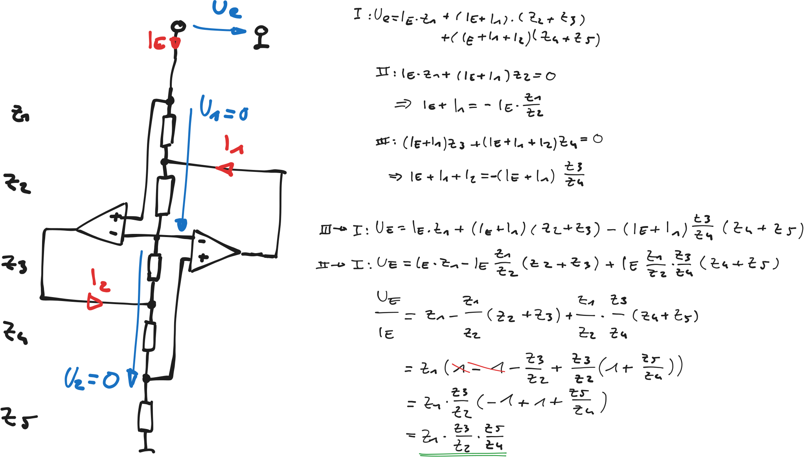

---
tags:
  - Baugruppe/OPV
aliases:
  - GIC
  - Generalized Impedance Converter
keywords:
subject:
  - Einführung Elektronik
  - VL
semester: WS24
created: 14. Januar 2025
professor:
release: false
---
 

# Generalized Impedance Converter

%%[🖋 Edit in Excalidraw](../../_assets/GICexcalidraw.md)%%
