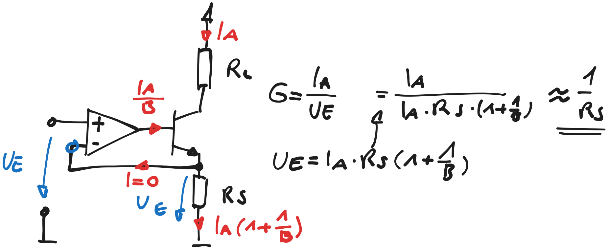

---
tags:
  - Baugruppe/Versorgung/Stromquelle
  - Baugruppe/OPV
aliases:
keywords:
  - Unidirektionale Konstantstromquelle
subject:
  - Einführung Elektronik
  - VL
semester: WS24
created: 23. September 2023
professor:
release: true
title: Konstantstromquelle
---
 

# Konstantstromquelle Mit OPV

> [!question] [OPV](index.md) | [Stromquelle](Stromquelle.md)

## Unidirektionale Konstantstromquelle

%%[🖋 Edit in Excalidraw](../../_assets/UnidirektionaleKonstStrom.md)%%

## Referenzen

[Elektronik Kompendium](https://www.elektronik-kompendium.de/public/schaerer/currop.htm)