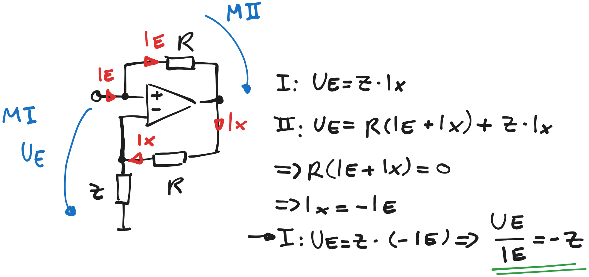

---
tags:
aliases:
  - NIC
keywords:
subject:
  - Einführung Elektronik
  - VL
semester: WS24
created: 29. Januar 2025
professor:
release: true
title: Negative Impedance Converter
---
 

# Negative Impedance Converter (NIC)

%%[🖋 Edit in Excalidraw](../../_assets/NICschematic.md)%%

Die Eingangsimpedanz dieser Schaltung wird von den Klemmen als $-Z$ gesehen

$$\frac{\underline{U}_{E}}{\underline{I}_{E}}=-\underline{Z}$$