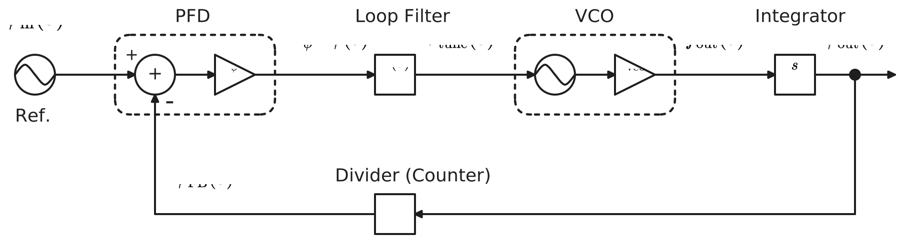
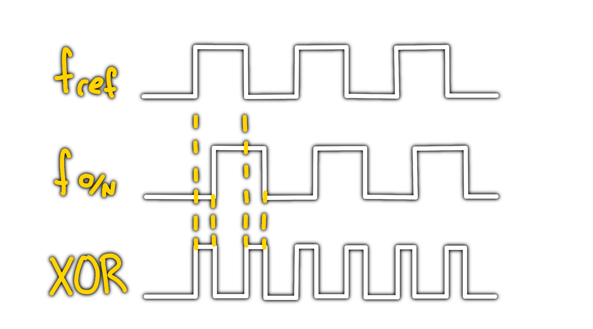
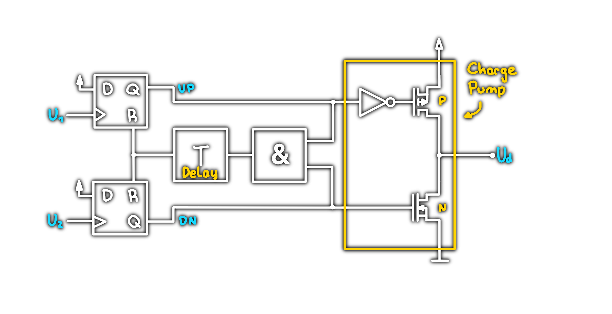

---
tags:
  - Baugruppe/Oszillator
aliases:
  - Phasenreglerschleife
  - PLL
keywords:
subject:
  - KV
  - Elektronische Systeme 1
semester: WS25
created: 27th February 2025
professor:
  - Reinhard Feger
release: true
title: Phase Locked Loop
---

# Phase Locked Loop (PLL)

Ein PLL ist ein Regelkreis, welches die Phasenlage und damit die Frequenz eines veränderbaren Oszillators so beeinflusst, dass die Phasenabweichung zu einem zu einem äußeren System möglichst konstant ist. 

%%[🖋 Edit in Excalidraw](../../_assets/Excalidraw/PLL.md)%%

Beim VCO ist der Term $\frac{1}{s}$ vorhanden (integrator): Die Ausgangsfrequenz des VCO muss wieder in eine Phase umgewandelt werden. Integration des Ausgangs da gilt: $\dot{\varphi} = \omega\implies \int \omega \mathrm{~d}t =\varphi$

## Regelkreis eines Linearen PLL

Modell des PLLs, welcher um den "locked State" - dem Eingeschwungen Verhalten - linear ist:

| Block            |                         Bild                          | Funktion                                                                                           |
| ---------------- | :---------------------------------------------------: | -------------------------------------------------------------------------------------------------- |
| Referenzphase    |         |                                                                                                    |
| PFD              |         | $I_{\mathrm{CP}}(s) = K_{\phi}\Delta\phi(s)=K_{\phi}(\phi_{\mathrm{in}}(s)-\phi_{\mathrm{FB}}(s))$ |
| Loop Filter      |  | $V_{\mathrm{tune}}(s) = I_{\mathrm{CP}}(s)Z(s)$                                                    |
| VCO              |         | $f_{\mathrm{out}}(s) = K_{\mathrm{VCO}}V_{\mathrm{tune}}(s)$                                       |
| Integrator       |         | $\phi_{\mathrm{out}}(s)= \dfrac{f_{\mathrm{out}}(s)}{s}$                                           |
| Feedback Divider |         | $\phi_{\mathrm{FB}}(s) = \dfrac{\phi_{\mathrm{out}}}{N}$                                           |

%%[🖋 Edit in Excalidraw](../../_assets/Excalidraw/Phase%20Locked%20Loop%202025-11-16%2001.50.03.excalidraw.md)%%

**Forward Loop Gain**

$$
G(s) = \frac{K_{\phi}Z(s)K_{\mathrm{VCO}}}{s}
$$

**Reverse Loop Gain**

$$
H(s) = \frac{1}{N}
$$

**Open Loop Gain**

$$
G(s)H(s) = \frac{K_{\phi}Z(s)K_{\mathrm{VCO}}}{sN}
$$

**Closed Loop Gain**

$$
\frac{\phi_{\mathrm{out}}(s)}{\phi_{\mathrm{in}}(s)} = \frac{G(s)}{1+G(s)H(s)} = \frac{\frac{K_{\phi}Z(s)K_{\mathrm{VCO}}}{s}}{1+\frac{K_{\phi}Z(s)K_{\mathrm{VCO}}}{sN}} = \frac{K_{\phi}Z(s)K_{\mathrm{VCO}}N}{Ns+K_{\phi}Z(s)K_{\mathrm{VCO}}}
$$

## Phasedetector (PD)

Der Phasedetector vergleicht die Phasenabweichung der Signale. Sind beide Frequenzen gleich, ist die PLL im *Locked*-Zustand, ansonsten (wenn ungleich) wird ein, der Abweichung proportionaler Ausgangsstrom ausgegeben.

### XOR Phase Detector

Ein einfaches Modell für einen Phasendetektor ist ein XOR-Gatter.  
Je größer die Phasenabweichung, desto höher das "PWM" am Ausgang des XOR Gatters.

 
### Phase Frequency Detector (PFD)

Eine sehr populäre Implementierung für den Phasen Detektor ist der Phase-Frequency-Detector.

siehe: [MT-086](../../_assets/pdf/MT-086.pdf)

## Loop Filter

Das PWM-Artige Ausgangssignal des PD wird mit einem Tiefpass gemittelt und liefert eine konstante Spannung proportional zum Arbeitszyklus, welche den VCO steuert.

> [!warning] Der Filter hat daher eine Tiefpass-Charakteristik.  
> 
> Tiefpass 1. oder 2. Ordnung

## VCO

- Der [VCO](Voltage%20Controlled%20Oscillator.md) setzt das Signal in eine Rechteckschwingung um.
- Interessant ist die sogenannte *center-frequency*, also jede Frequenz, mit der der [Oszillator](../../Digital-Design/Clock-Generierung.md) im Locked-Zustand schwingt.
- Um sie herum findet der Regelvorgang statt.
- In PLL-Schaltungen kommen für die [Oszillatoren](../../Digital-Design/Clock-Generierung.md) hauptsächlich [LC-Oszillatoren](LC%20Oszillatoren.md) (weniger häufig RC-[Oszillatoren](../../Digital-Design/Clock-Generierung.md)) sowie Ringoszillatoren zum Einsatz.

## Rauschmodell

#todo

## Kennwerte 

| Kennwert                        |                                                                                                |
| ------------------------------- | ---------------------------------------------------------------------------------------------- |
| **Lock Range**                  | PLL folgt der Frequenzänderung innerhalb eines Taktes                                          |
| **Pull out Range**              | spezifizierte Zeit für größere Frequenzänderungen um wieder den „locked“ Zustand zu erreichen. |
| **Lock time**                   | Einschwingzeit                                                                                 |
| **Operationsbereich**           | der von der PLL überdeckte Frequenzbereich                                                     |
| **Frequenzmultiplikator**       | ganzzahlig / fraktional                                                                        |
| **Ordnung der PLL**             | Ordnung des Loop Filters                                                                       |
| **Frequenzstabilität / Jitter** |                                                                                                |

## Referenzen

[Clock_und_Reset_Generierung](../../_assets/pdf/Clock_und_Reset_Generierung.pdf)
[MT-086](../../_assets/pdf/MT-086.pdf)
