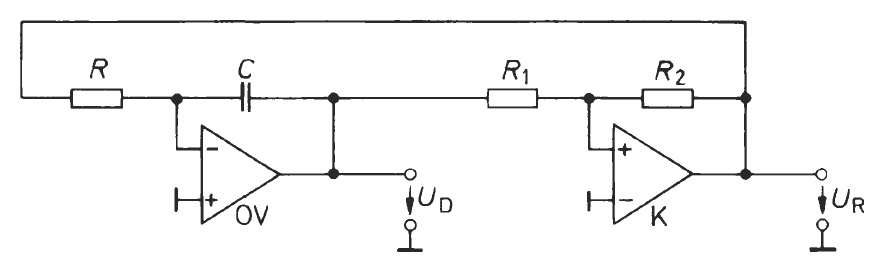

---
tags:
  - Baugruppe/Oszillator
aliases: []
subject:
  - hwe
created: 20th December 2022
title: Relaxationsoszillator
---

# Relaxationsoszillator

- Rückgekoppelte Schaltung
- Lade und Entladevorgänge von Kondensatoren zur Festlegung der Periodendauer und Signalform

## Rechteck-Dreieck-Generator

### Schaltung

# Tags

[Oszillator](../../Digital-Design/Clock-Generierung.md)
