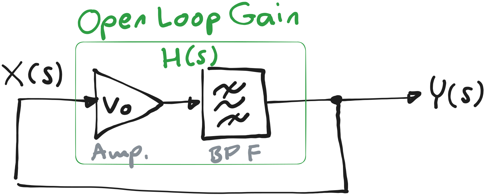

---
tags:
aliases:
keywords:
subject:
  - KV
  - Elektronische Systeme 1
semester: WS25
created: 15th November 2025
professor:
  - Reinhard Feger
release: true
title: Verstärker-Bandpass Oszillator
---

# Oszillator Modell mit Verstärker und Bandpass

> [!question] [Oszillator](index.md)

%%[🖋 Edit in Excalidraw](../../_assets/Excalidraw/OszAmpBPF.md)%%

Der **Open Loop Gain** entspricht der Übertragungsfunktion des Bandpasses

