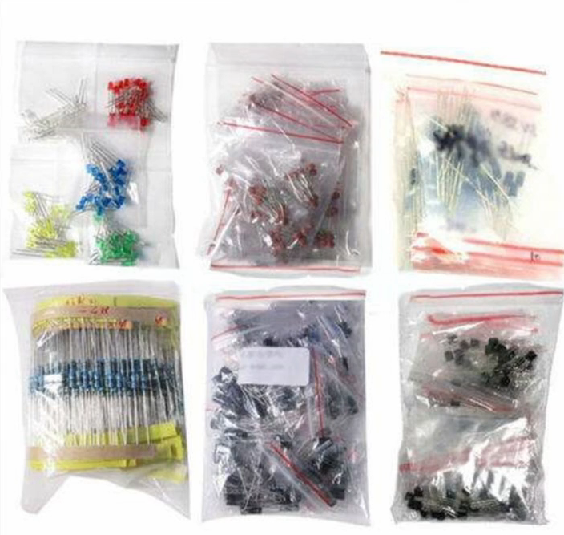
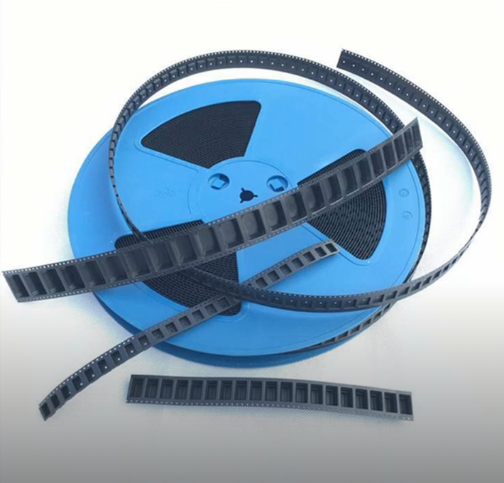
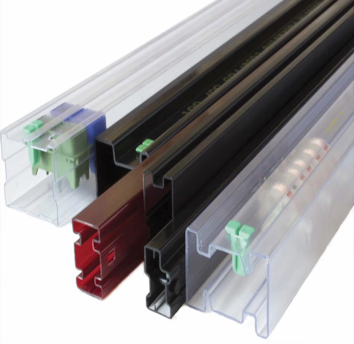
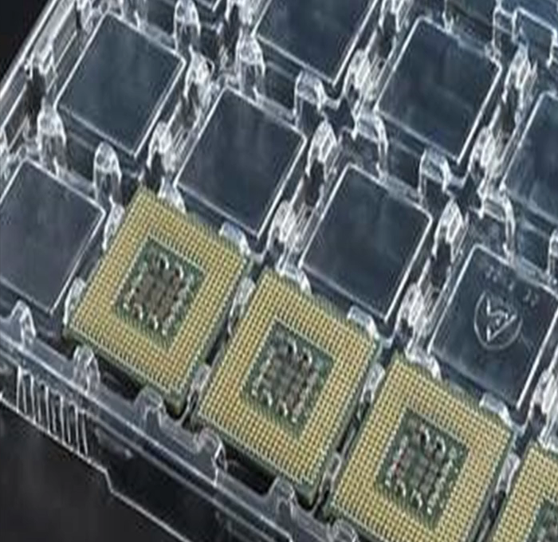
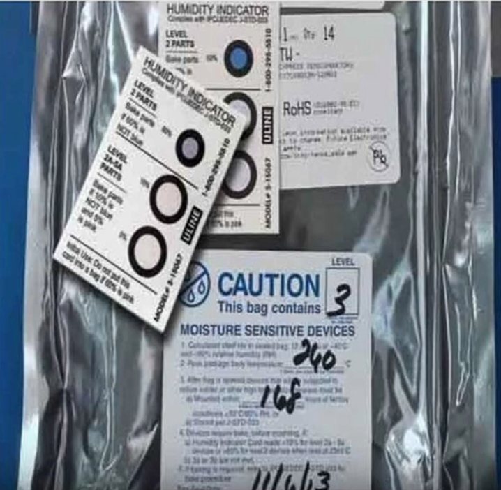

---
tags:
  - Product-Development
aliases:
created: 19. September 2024
---

# Elektronik Produktentwicklung

- Prototyp
- Testing
- [Zertifizierung](Certification.md)
- Einkauf

## Prototyp

- Zusätzliche Test Pins
- Pilot Run 

## Einkauf

### Dokumente und Software

1. **MRP - Material Requirements Planning**: Software zur Verwaltung von Inventar und Einkauf von Parts 
2. **BOM - Bill of Materials (Stückliste)**: [Beschreibeung, Part NR, Designator, Preis, Distributor]
    - [Mouser Forte](https:/www.mouser.com/bomtool/)
3. **PO**: Purchase Order (Generiert vom MRP)

### Händler / Vendor / Distributor / Supplier

1. **AVL - Approved Vendor List:** Liste im MRP
2. **P&A - Price and Availability:** Quote, Info auf der Website des Händlers
3. **ATS - Available to Ship**
4. **AOO - Available On Order**

### Part

#### Life Cycle

1. **==Active==**
2. *==NRND==* - Not Recommended for New Designs
3. *==EOL==* - End of Life
4. *==Obsolete==* - Ersetzt durch neueres Produkt
5. ==NPI== - New Product Introduction

#### Packaging

 ***Ammo Packaging***

- Papier Tape
- nur für THT

==Leads **Abzwicken**==
- Sonst verbleiben Klebereste auf den Mounting Holes
- Verursacht Kalte Lötstellen und verschmutzung

 

 ***Bulk Packaging***

- Sackal 
- Nicht [ESD](ESD.md) geeignet
- Typischerweise THT und Prototyp komponenten
- Nur für Manuelle Bestückung

   

 ***Cut Tape & Reel Packaging***

- SMD
- für PnP (Pick and Place) geeignet
- Automatische Bestückung möglich
- ESD Sicher
- Cut Tape: abgeschnittenes Stück eines Reels 

  

 ***Tube***

- THT und SMD
- PnP möglich
- ESD Sicher

   

 ***Tray***

- Bevorzugt zur Lagerung
- PnP möglich
- für Größere Module
- ESD Sicher (meistens)

  

 ***[ESD](ESD.md) Sackal***

- Einzeilteile in ESD Sackerl

     

 ***MSL***

- Für Feuchtigkeitsempfindliche komponenten
- Feuchtigkeits indikator enthalten