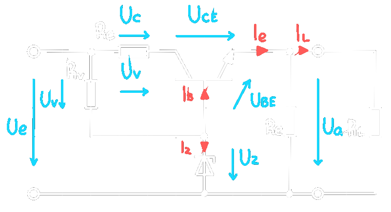

---
tags:
  - Baugruppe/Versorgung
  - Halbleiter/BJT
aliases:
  - Längstransistor
  - Längstransistorschaltung
keywords:
subject:
  - Einführung Elektronik
  - VL
semester: WS24
created: 22. September 2023
professor:
release: false
---

# Längstransistor Mit [Zener-Diode](../Halbleiter/Zener-Diode.md)

> Basisschaltung

# Längsregler

