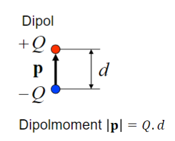

---
tags:
  - Dipol
aliases:
  - Dipolmoment
  - Dipolmoments
created: 15. November 2023
---

# Dipol

> siehe auch: Elektrischer [elektrischer Dipol](../Elektrotechnik/elektrischer%20Dipol.md)

| [Molekül](Atombindung.md)                    | VSF                    | Ladungsverteilung  |
| -------------------------- | ---------------------- | ------------------ |
| $HCl$   $\Delta EN=0.9$ | > | > |

Dipolpfeil zeigt zur negativen [Ladung](../Elektrotechnik/elektrisches%20Feld.md) ([Vektor](../Mathematik/Algebra/Vektor.md) des Dipolmoments)
> [!info] Wichtigstes Dipolmolekül: $H_{2}O$

## Dipolmoment

Teilpole addieren sich zum Dipolmoment:  
**Einheit:** D - Debey  
$H_{2}O$: $1.9D$  
$HCl$: $1.1D$  
$H_{2}S$: $1.1D$

Weil Dipole sich elektrisch anziehen, kondensieren diese leicht  
$H_{2}O$ flüssig  
$H_{2}S$ gasförmig (geringeres Dipolmoment)

 

> [!INFO] Dipolmoment
> $\mid\vec{p}\mid=Q\cdot d$
> $+Q$ und $-Q$ sind die Ladungsschwerpunkte des Moleküls
> $Q$ wird ist da selbe wie $\delta$ bisher

# Magnetischer Dipol

rotierende Ladungen im Molekül

Sind alle Magnetischen Dipole im Material in die Selbe Richtung gerichtet, hat man einen Permanent Magneten

Man kann diese Dipole auch künstlich richten. Wenn man ein Magnetfeld durch einen Leiter Legt, richten sich die Dipole. Das Material wird mit hysteresem Verlauf Magnetisiert. Funktioniert nur mit Ferromagnetischen Materialien (Fe, [Ni](../Physik/Materialkunde/Nickel.md), Co).

---

# Tags

[Polarisation](Polarisation.md)
[Elektrisches Dipolmoment – Wikipedia](https://de.wikipedia.org/wiki/Elektrisches_Dipolmoment)