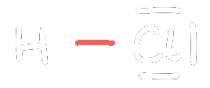
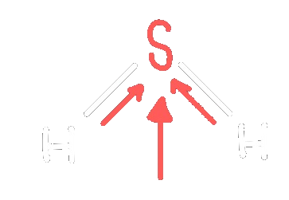

---
tags:
  - Dipol
aliases:
  - Dipolmoment
created: 15. November 2023
---

# Dipol

> siehe auch: Elektrischer [Dipol](../Elektrotechnik/Dipol.md)

| [Molekül](Atombindung.md)                    | VSF                    | Ladungsverteilung  |
| -------------------------- | ---------------------- | ------------------ |
| $HCl$   $\Delta EN=0.9$ | > | > |

Dipolpfeil zeigt zur negativen [Ladung](../Elektrotechnik/Statisches%20E-Feld.md)  
Wichtigstes Dipolmolekül: $H_{2}O$

## Dipolmoment

Teilpole addieren sich zum Dipolmoment:  
**Einheit:** D - Debey  
$H_{2}O$: $1.9D$  
$HCl$: $1.1D$  
$H_{2}S$: $1.1D$

Weil Dipole sich elektrisch anziehen, kondensieren diese leicht  
$H_{2}O$ flüssig  
$H_{2}S$ gasförmig (geringeres Dipolmoment)

 

---