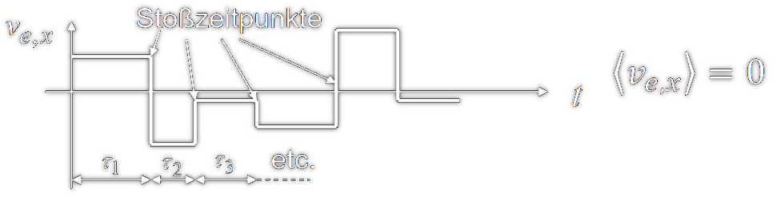

 

# Drude-Modell - Modell für den elektrischen [Strom](../Elektrotechnik/elektrischer%20Strom.md)

> [!info] Mit dem [Drude-Modell](../Chemie/Drude-Modell.md) lässt sich die Elektronenbewegung des elektrischen [Stroms](../Elektrotechnik/elektrischer%20Strom.md) statistisch Auswerten.

Da in einem konstanten [Elektrischen Feld](../Elektrotechnik/Elektrisches%20Feld.md) auf ein Elektron die [elektrische Kraft](../Elektrotechnik/Elektrische%20Kraft.md) $-e\cdot \vec{E}$ wirkt und *massebehaftete* Körper (also auch Elektronen) unter Einfluss einer [Kraft](../Physik/Newtonsche%20Axiome.md) beschleunigen, müssten alle Elektronen unter Einfluss dieses E-Feldes in negative Richtung beschleunigen.

> [!warning] Unter Annahme eines konstanten Feldes 𝐄 würde ein Elektron mit der [Kraft](../Physik/Newtonsche%20Axiome.md) −𝑒𝐄 beschleunigt.
> Tatsächlich stellt sich aber eine mittlere Driftgeschwindigkeit 𝐯 ein, die in erster Näherung proportional zu 𝐄 ist.
> Der Grund liegt in der Wechselwirkung (Stößen) mit dem Gitter.

Die Mittlere Driftgeschwindigkeit $\langle v\rangle$ der Elektronen im [Metall](../Chemie/Metallbindung.md) ist ohne einem [elektrischen Feld](Elektrisches%20Feld.md) im Mittel Null.
Obwohl sich die Elektronen individuell betrachtet durch die [thermische](../Physik/Temperatur%20und%20Teilchenmodell.md) Wimmelbewegung **sehr** schnell bewegen.

## 1 1 Beweglichkeit - Zusammenhang mit mittlerer Flugzeit

- Thermische Bewegung eines Elektrons in x-Richtung (ohne elektrisches Feld). Mit jedem Stoß Streuung in zufällige Richtung, Mittelwert der Geschwindigkeit=0

