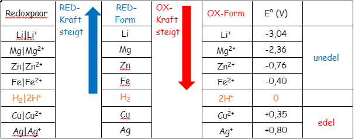

# Elektrochemische Spannungsreihe

> [!question] [elektrische Spannung](../Elektrotechnik/Elektrostatik/elektrische%20Spannung.md)

Ordnet man [Redoxpaare](Oxidation%20und%20Reduktion.md) (z.B.: $Zn_{(RED)}|Zn^{2+}_{(OX)}$) nach ihren Standardpotentialen E° beginnend mit der niedrigsten, so erhält man die Spannungsreihe

## Was Lässt Sich Aus Tabelle Ableiten?

- Ob [Metall](Metallbindung.md) edel oder unedel ist  **(Auflösung in Salzlösung)** 
- Aus Differenz der E° kann Spannung jedes galvanischen Elementes berechnet  werden.
	- *$Ag-Cu$-Element:* $0.80 – 0.35 = 0.45V$
	- *$Cu-Fe$-Element:* $0.35 – (-0.40) = 0.75V$
- Die Mindestspannung für eine [Elektrolyse](Elektrochemie.md) 
- Ob ein [Metall](Metallbindung.md) (aber auch Element) *reduzierend* oder *oxidierend* wirkt.
	- F2 + 2e- → 2F- (+2,87V)
	- *[Redoxpaar](Oxidation%20und%20Reduktion.md):* 2F-| F2 → F2 wirkt oxidierend und greift jedes [Metall](Metallbindung.md) an
