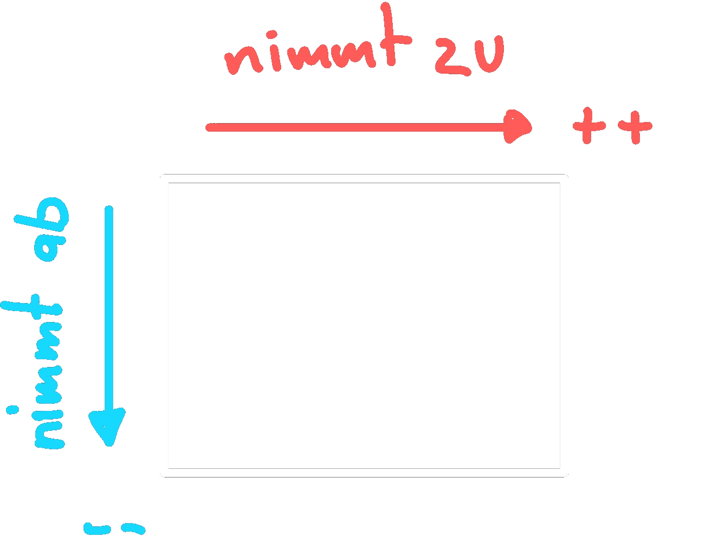

---
tags:
aliases:
created: 15th January 2026
title: Elektronenaffinität
release: false
---

# Elektronenaffinität (EA)

> [!important] Jene Energie die man benötigt$_{1)}$ oder erhält$_{2)}$, sodass ein $e^{-}$ hinzugefügt wird.
> 
> 1. $Na$
> 2. $F$

Die höchste *EA* hat Fluor.  
Edelgase haben keine Tendenz, $e^{-}$ aufzunehmen.