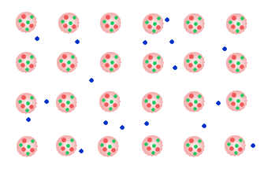

---
tags:
  - Chemie/Anorganisch
aliases:
  - Metall
  - Metalle
  - Metallen
subject:
  - chemie
created: 31. August 2023
professor:
  - Fritz Struber
  - Bernhard Jakoby
---

# Metallbindung

Starke Anziehungskräfte zwischen [Kationen](Ionenbindung.md) und Elektronengas (auch Fermi-[Gas](../Physik/Allgemeines%20Gasgesetz.md)) halten das Metallgitter zusammen.

## 1 Eigenschaften Von Metallen

Aus Gitteraufbau folgt:
- bei Raumtemperatur sind diese fest (Ausnahmen: $Hg,Cs,Ga$)
- sehr gute [elektrische Leiter](elektrischer%20Leiter.md) (Leiter 1. Klasse)
- sind glänzend
- sind duktil (mechanisch verformbar) $\rightarrow$ Gitterebenen gleiten übereinander
- bilden **Legierungen** (Atome im Metallgitter können ausgetauscht werden)

>[!NOTE] Legierung  
Mischung von min. zwei Metallen (oder Metalle und Nichtmetalle)

## 2 [Elektrische Leitfähigkeit](elektrischer%20Leiter.md)

> [!QUESTION] In elektrischen Leitern liegen bewegliche Ladungsträger vor.

Im Falle von Metallen arrangieren sich die Atome in einem Gitter wobei die äußeren Elektronen der Atome sich relativ *frei* zwischen den Gitterbausteinen (Atome ohne äußere Elektronen, also positiv geladene Ionen) bewegen können.

Da diese Situation für diese so genannten Leitungselektronen ähnlich ist, wie die von Molekülen eines Gases spricht von einem *Elektronengas* oder Fermi-[Gas](../Physik/Allgemeines%20Gasgesetz.md).

> [!WARNING] Das Metall ist an sich elektrisch neutral,  
>  wenn die Leitungselektronen sich aber ungleichmäßig verteilen, dann kann es zu lokalen positiven oder negativen Ladungsüberschüssen kommen.

> [!HINT] Die Leitungselektronen führen eine [thermische](../Physik/Temperatur%20und%20Teilchenmodell.md) Wimmelbewegung aus.  
> Der [Betrag](../Mathematik/Betrag.md) dieser [Geschwindigkeit](../Physik/Kinematik.md) kann in der Größenordnung von $10^6  \frac{m}{s}$ sein
>
> > [!INFO] liegt damit weit über den Driftgeschwindigkeiten, die durch elektrischen [Strom](../Elektrotechnik/elektrischer%20Strom.md) verursacht werden
> > Diese Eigenschaft führt zum [Drude-Modell](Drude-Modell.md). 
> 
