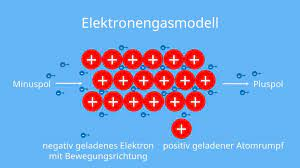

---
tags:
  - Chemie/Anorganisch
aliases:
  - Metall
subject:
  - chemie
source:
  - Fritz Struber
created: 23rd August 2022
---

# Metallbindung

Starke Anziehungskräfte zwischen [Kationen](Ionenbindung.md) und Elektronengas halten das Metallgitter zusammen.

## Eigenschaften Von Metallen

Aus Gitteraufbau folgt:
- bei Raumtemperatur sind diese fest (Ausnahmen: $Hg,Cs,Ga$)
- sehr gute [elektrische Leiter](../Physik/elektrische%20Leiter.md) (Leiter 1. Klasse)
- sind glänzend
- sind duktil (mechanisch verformbar) $\rightarrow$ Gitterebenen gleiten übereinander
- bilden **Legierungen** (Atome im Metallgitter können ausgetauscht werden)

>[!NOTE] Legierung  
Mischung von min. zwei Metallen (oder Metalle und Nichtmetalle)

# Tags

- [elektrische Leiter](../Physik/elektrische%20Leiter.md)