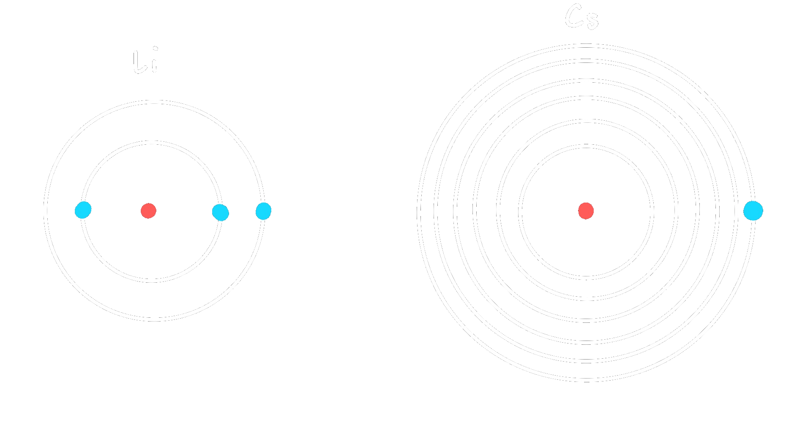

# 3.2 Metallcharakter

- [Metalle](Metallbindung.md) sind Elemente mit hoher Leitfähigkeit.
- $e^{-}$ müssen locker sitzen.
- Dies ist bei größeren Atomen der Fall: stehen links und weiter unten im [PSE](Periodensystem%20der%20Elemente.md).

