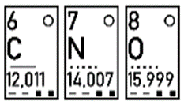

---
tags:
  - Chemie/Anorganisch
aliases:
  - Molares Volumen
  - Gasvolumen
subject:
  - physik
source:
  - Fritz Struber
created: 10th September 2022
---

# Molvolumen

> [!EXAMPLE] Berechne die Masse 1m³ [Luft](../Physikw/Lufthülle%20der%20Erde.md) – 78%N2, 21% O2, 1% Argon  
>   
> 

# Gasvolumen