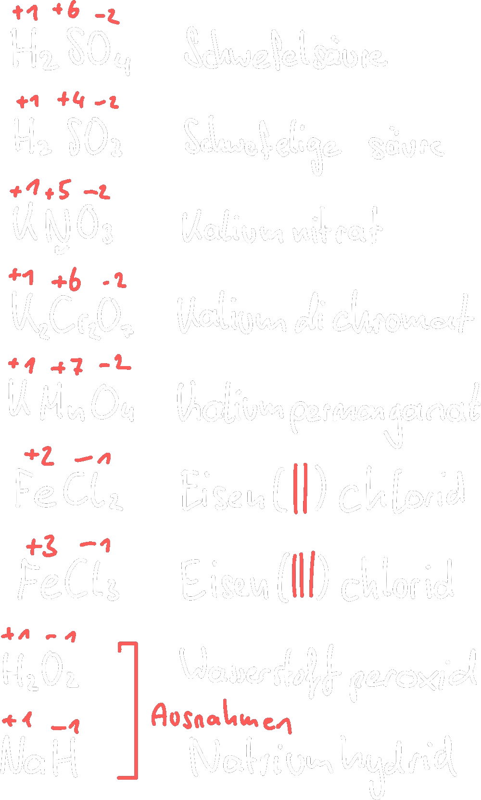

---
tags:
  - Chemie/Anorganisch
aliases:
  - Oxidation
  - Reduktion
  - endotherm
  - exotherm
  - Exotherm
  - Endotherm
  - Redoxreaktion
  - Redoxpaare
  - Redoxpaar
subject:
  - chemie
source:
  - Fritz Struber
created: 19th August 2022
---

# Oxidation Und Reduktion

Oxidation: 
- Ursprüngliche Aufnahme von Sauerstoff
- gebildete Stoffe: **Oxide**
- Reaktion ist exotherm ($\Delta H<0$)
- Abgabe von $e^{-}$ 

$C+O_{2}\longrightarrow CO_{2}$  
$2Mg+O_{2} \longrightarrow 2MgO$

Reduktion: 
- Ursprünglicher Entzug von Sauerstoff
- Meistens Rückführung eines Metalloxids in das [Metall](Metallbindung.md)
- Reaktion ist endotherm 
- Aufnahme von $e^{-}$ 

$HgO \longrightarrow Hg + \frac{1}{2}O$  
Oder unter Einsatz von Reduktionsmitteln (z.B. $C$):  
$MgO + C \longrightarrow Mg + CO_{2}$  
$Fe_{2}O_{3} + 3C \longrightarrow 2Fe + 3CO$

## Was Passiert Genau?

$2Mg+O_{2}\longrightarrow2MgO$

Elektronenübertragung von $Mg$ zu $O$  
$\rightarrow$ Führt zu $MgO$ ([Salz](Ionenbindung.md))

**RGL:**

$Mg$ wird oxidiert $Mg \longrightarrow Mg^{2+}+2e^{-}$  
OXIATION: Abgabe von $e^{-}$ 

$O$ wird reduziert $O+2e^{-}\longrightarrow O^{-2}$  
REDUKTION: Aufnahme von $e^{-}$ 

Oxidation und Reduktion laufen **immer** gekoppelt ab. Nur wenn ein Stoff $e^{-}$ aufnimmt, kann ein anderer welche abgeben.

# Redoxreaktion

Chemische Reaktionen mit $e^{-}$ Übertragungen (Oxidation und Reduktion laufen gleichzeitig ab)

Reduktionsmittel:
- geben gerne $e^{-}$ ab und werden selbst oxidiert
- [Metalle](Metallbindung.md) mit geringer Elektronegativität (Alkalimetalle)
 - z.B.: $H_{2}, Mg, C$ 

Oxidationsmittel:
- nehmen gerne $e^{-}$ auf und werden selbst reduziert.
- Nichtmetalle mit hoher Elektronegativität (Halogene). 

z.B.: $O_{2}, F_{2}$ 

Ob ein Stoff ein Oxidationsoder Reduktionsmittel, hängt von der Stellung im [PSE](Periodensystem%20der%20Elemente.md) ab und zwar von der ).

> [!EXAMPLE] Reduktion von $CuO$ mit $H_{2}$
> $$\begin{align*}
> H_{2} &\longrightarrow H_{2}^{+2} + 2e^{-}\\
> H_{2}^{+2} + CuO + 2e^{-} &\longrightarrow H_{2}^{+2}O^{-2} + Cu^{+2} + 2e^{-}\\
> &=H_{2}O + Cu
> \end{align*}$$

Redoxreaktionen können auch durch Zuund Abfuhr von $e^{-}$ an einer Gleichspannungsquelle erfolgen: [Elektrolyse](Elektrochemie.md)

Kathode (-): Reduktion (Aufnahme von $e^{-}$)  
Anode (+): Oxidation (Abgabe von $e^{-}$) 

# Oxidationszahl

Ist die formale [Ladung](../Elektrotechnik/Statisches%20E-Feld.md) eines Atoms in einem [Molekül](Atombindung.md) zur tatsächlichen [Ladung](../Elektrotechnik/Statisches%20E-Feld.md) einatomiger Ionen

$$
\text{Ionen}\begin{dcases}
\begin{align*}
Na^{+}Cl^{-} &\rightarrow NaCl\\
Cu^{2+}Cl^{-} &\rightarrow CuCl_{2}\\
\end{align*}
\end{dcases}
$$

## Regeln Zur Bestimmung Von Oxidationszahlen

1. Elemente = 0
2. Summe der Oxidationszahl einer Verbindung = 0
3. Ionenladung = Oxidationszahl
4. [Metalle](Metallbindung.md) immer positiv:
	- $\rightarrow$ Alkalimetalle +1 
	- $\rightarrow$ Erdalkalimetalle +2 
5. Halogene: -1
6. Wasserstoff: +1
7. Sauerstoff: -2

 > [!EXAMPLE] Bestimme die Oxidationszahlen  
 > $H_{2}SO_{4}$, $H_{2}SO_{3}$, $KNO_{3}$, $K_{2}Cr_{2}O_{3}$, $KMnO_{4}$, $FeCl_{2}$, $H_{2}O_{2}$, $NaH$
 > > [!success] Lösungen  
 > > 

## Anwendung Von Oxidationszahlen

1. Benennen von Verbindungen

|               Verbindung               | Benennung          |
|:--------------------------------------:| ------------------ |
|   $\overset{+1}{Cu}\overset{-1}{Cl}$   | Kupfer(**I**)-chlorid  |
| $\overset{+2}{Cu}\overset{-1}{Cl_{2}}$ | Kupfer(**II**)-chlorid |
| $\overset{+2}{Fe}\overset{-1}{Cl_{2}}$ | Eisen(**II**)-chlorid  |
| $\overset{+3}{Fe}\overset{-1}{Cl_{3}}$ | Eisen(**III**)-chlorid |

1. Feststellen ob ein Element oxidiert oder reduziert wird  
   Oxidation: Oxzahl nimmt zu.  
   Reduktion: Oxzahl nimmt ab.
2. Einrichten komplizierter RGL

---

# Tags