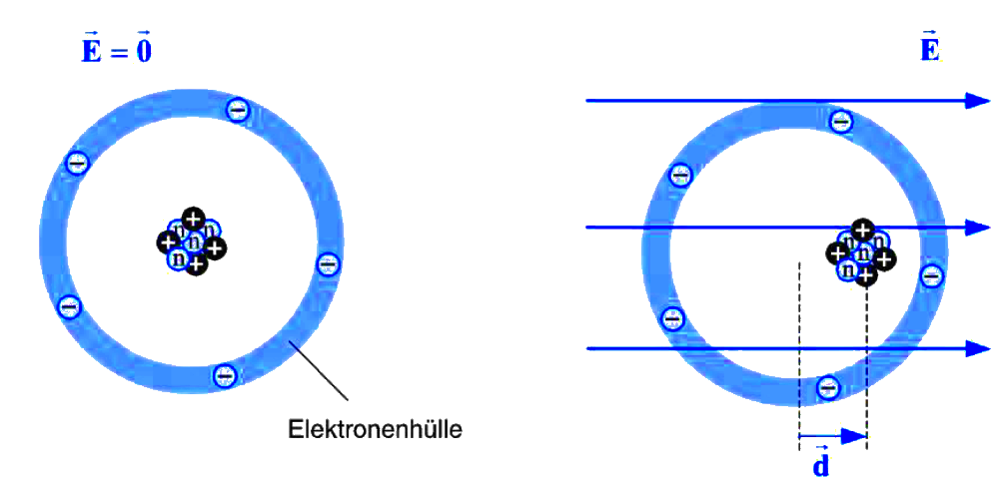

 

# Polarisierung

> [!important] Polarisation: Ladungsschwerpunkte des Moleküls, richten sich nach dem [elektrischen Feld](Elektrisches%20Feld.md) aus

In der Regel erzeugen Atomgebundene [Moleküle](Atombindung.md) trotz Ladungsdifferenz kein [elektrisches Feld](../Elektrotechnik/Elektrisches%20Feld.md). Das liegt daran dass diese [Ladungen](../Elektrotechnik/elektrische%20Ladung.md) nicht gerichtet sind.

Zeigt der [Vektor](../Mathematik/mathe%20(3)/Vektor.md) des [Dipolmoments](Dipol%20(Chemie).md) im Stoff überwiegend in die selbe Richtung (durch Einbringen in ein [statisches E-Feld](../Elektrotechnik/Statisches%20E-Feld.md)), ist der Stoff Polarisiert. Dieses [E-Feld](../Elektrotechnik/Elektrisches%20Feld.md) wird durch die ausgerichteten ladungsschwerpunkte Abgeschwächt. Das Ausmaß dieser Abschwächung hängt von der [Permittivität](../Elektrotechnik/Dielektrikum.md) des [Dielektrikums](../Elektrotechnik/Dielektrikum.md) ab.

Dies ist nützlich für:
- [Kondensator](../Elektrotechnik/Kapazität.md) 
- [Dielektrikum](../Elektrotechnik/Dielektrikum.md) in einem Leiterplattensubstrat

# Tags

[Polarität (Chemie) – Wikipedia](https://de.wikipedia.org/wiki/Polarit%C3%A4t_(Chemie))
[Permittivität – Wikipedia](https://de.wikipedia.org/wiki/Permittivit%C3%A4t)