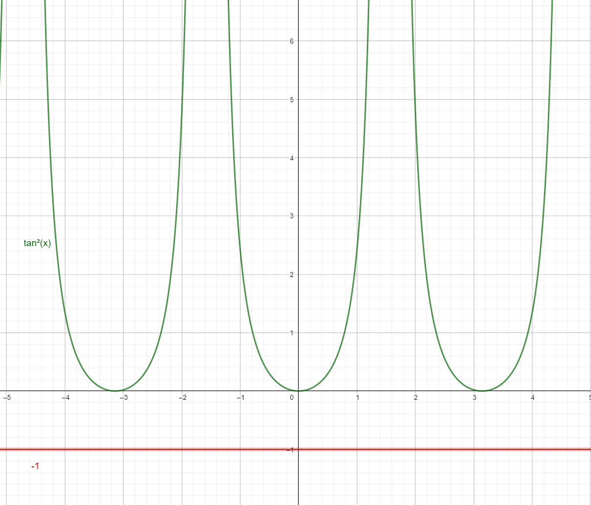

---
tags:
aliases:
keywords:
subject:
  - VL
  - Grundlagen der Hochfrequenztechnik
semester: WS25
created: 12th February 2026
professor:
release: false
title: Polarisierte Welle
---

# Polarisierte Welle

Die Polarisation einer EM-Welle ist dadurch definiert, wie der Vektor des E Feldes im Koordinatensystem liegt.

- Vertikal
- Horizontal
- Zirkular polarisiert

## Polarisierte Welle an Grenzflächen

Vorrausgesetzt sind **verlustlose** und rein **dielektrische** Materialien

- Parallelpolarisiert
- Normalpolarisiert

Es gilt

$$
k_{1}\sin\theta_{i} = k_{1}\sin\theta_{r} = k_{2}\sin\theta_{t}
$$

bekannt als das Snelliussche gesetzt der Reflektion und der Brechung

$$
\begin{align}
\theta_{i} &= \theta_{r} \\
k_{1}\sin\theta_{i} &= k_{2} \sin\theta_{r}
\end{align}
$$

### Parallele Polarisation

$$
\begin{align}
\Gamma = \frac{\eta_{2}\cos\theta_{t} - \eta_{1}\cos\theta_{i}}{\eta_{2}\cos\theta_{t} + \eta_{1}\cos\theta_{i}} \\
T = \frac{2\eta_{2}\cos\theta_{i}}{\eta_{2}\cos\theta_{t} + \eta_{1}\cos\theta_{i}} \\
\end{align}
$$

#### Brewster Winkel

Ein Fall $\Gamma=0$ tritt ein, wenn der Zähler des ausdrucks gleich $0$ ist d.h. $\eta_{2}\cos\theta_{t} = \eta_{1}\cos\theta_{i}$. Der Einfallswinkel $\theta_{i} = \theta_{b}$ bei dem dieser Fall eintritt heißt **Brewster Winkel**.

$$
\eta_{2}\cos\theta_{t} = \eta_{1}\cos\theta_{b} \implies \cos\theta_{t} = \frac{\eta_{1}}{\eta_{2}} \cos\theta_{b}
$$

Um $\theta_{b}$ zu berechnen, wird der Trasmssionswinkel mit dem Snelliusschen Brechnungsgesetz eliminiert

$$
k_{1} \sin\theta_{b} = k_{2} \sin\theta_{t} \implies \sin \theta_{t} = \frac{k_{1}}{k_{2}} \sin\theta_{b}
$$

Mit $\cos^{2} \theta_{t} + \sin^{2}\theta_{t} = \cos^{2} \theta_{b} + \sin^{2}\theta_{b} = 1$ folgt

$$
\begin{align}
\left( \frac{\eta_{1}}{\eta_{2}} \cos\theta_{b} \right)^{2} +
\left( \frac{k_{1}}{k_{2}}       \sin\theta_{b} \right)^{2} &= 
\cos^{2} \theta_{b} + \sin^{2}\theta_{b}\,{\color{grey} = 1} \\

\left( \frac{\eta_{1}^{2}}{\eta_{2}^{2}} - 1 \right)\cos^{2}\theta_{b} &=
\left( 1 - \frac{k_{1}^{2}}{k_{2}^{2}}       \right)\sin^{2}\theta_{b} \\

\frac{ \sin^{2}\theta_{b} }{ \cos^{2} \theta_{b} } &=
\frac{ \frac{\eta_{1}^{2}}{\eta_{2}^{2}} -1 }{ 1 - \frac{k_{1}^{2}}{k_{2}^{2}} }
\end{align}
$$

Da $k^{2} = \omega^{2}\mu_{0}\epsilon$ und $\eta^{2} = \frac{\mu_{0}}{\epsilon}$:

$$
\frac{\eta_{1}^{2}}{\eta_{2}^{2}} = \frac{\epsilon_{2}}{\epsilon_{1}} \qquad \frac{k_{1}^{2}}{k_{2}^{2}}=\frac{\epsilon_{1}}{\epsilon_{2}}
$$
$$
\tan ^{2}\theta_{b} = \frac{ \frac{\epsilon_{2}}{\epsilon_{1}} -1 }{ 1-\frac{\epsilon_{1}}{\epsilon_{2}} } = \frac{\epsilon_{2}}{\epsilon_{1}}
$$

### Normalpolarisiert

$$
\begin{align}
\Gamma = \frac{\eta_{2}\cos\theta_{i} - \eta_{1}\cos\theta_{t}}
              {\eta_{2}\cos\theta_{i} + \eta_{1}\cos\theta_{t}} \\
T = \frac{2\eta_{2}\cos\theta_{i}}
         {\eta_{2}\cos\theta_{i} + \eta_{1}\cos\theta_{t}} \\
\end{align}
$$

> [!warning] Man beachte, dass die indizes von $i$ und $t$ vertauscht sind

Besonders ist, dass für den Zähler des Reflexionsfaktors gilt, dass dieser niemals $0$ werden kann. Das sei gezeigt, dass mit der vorhergehensweise wie oben gilt:

$$
\tan ^{2}\theta_{i} = \frac{ \frac{\eta_{\color{red}2}^{2}}{\eta_{\color{red}1}^{2}} -1 }{ 1 - \frac{k_{1}^{2}}{k_{2}^{2}} }
$$

Mit $k^{2} = \omega^{2}\mu_{0}\epsilon$ und $\eta^{2} = \frac{\mu_{0}}{\epsilon}$

$$
\frac{\eta_{2}^{2}}{\eta_{1}^{2}} = \frac{\epsilon_{1}}{\epsilon_{2}} \qquad \frac{k_{1}^{2}}{k_{2}^{2}}=\frac{\epsilon_{1}}{\epsilon_{2}} \implies
\tan ^{2}\theta_{i} = \frac{\frac{\epsilon_{1}}{\epsilon_{2}}-1}{1-\frac{\epsilon_{1}}{\epsilon_{2}}} = -1
$$

Da es dafür $\tan ^{2}\theta_{i}<0$  jedoch keine reelle Lösung gibt, kann dieser Fall nicht eintreten.

### Vergleich beider Polarisationen

