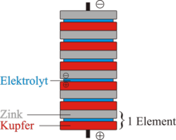
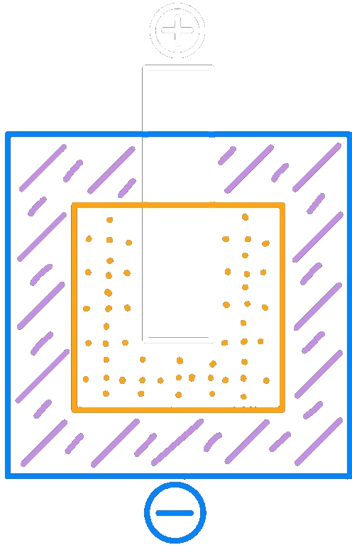

---
tags:
  - Chemie/Anorganisch
aliases:
  - Batterie
  - Batterien
  - Primärelemente
subject:
  - chemie
source:
  - Fritz Struber
created: 21st August 2022
---

# Primärelemente (Batterien)

Galvanisches Element mit irreversiblen elektrochemischen Vorgang $\rightarrow$ *nicht Aufladbar* $\rightarrow$ Batterie 

## Voltasche Säule

$Zn$ - Zink  
$H_{2}SO_{4}$ - Salzsäure  
$Cu$ - Kupfer

## Daniell-Element

- Cu/Zn in Metallsalzlösung

## Leclanché-Element

- Zink-Kohle-Batterie (Taschenlampenbatterie)
- $U=1.5V$
- Probleme: $Zn$ löst sich auf und die Elektrolytpaste rinnt aus. Spannung sinkt bei Stromentnahme stark ab.
>   
> Grafitstab (weiß)
> Zn-Becher (blau)
> Braunstein ($MnO_{2}$) (orange)  
> Elektrolytpaste ($NH_{4}Cl - H_{2}O$) (lila) 

Anode (-): $Zn\longrightarrow Zn^{2+}+2e^{-}$  
Kathode: (+) $2MnO_{2}+2e^{-}+\underbrace{2H^{+}+2OH^{-}}_{2H_{2}O}\longrightarrow 2\overset{3+}{Mn}O(OH)$  
Wasser aus [Elektrolyt](Elektrochemie.md) teilt sich auf, da $MnO_{2}$ neutral geladen ist

## Alkali-Mangan-Batterie

- Stahlbecher statt Zinkbecher
- Zinkpulver als Gel im Inneren
- **$KOH$** als [Elektrolyt](Elektrochemie.md) $\rightarrow$ $U$ bleibt konstant

Anode: (-) $Zn + 2OH^{-}\longrightarrow Zn(OH)_{2}+2e^{-}$  
Kathode (+): $2MnO_{2}+2H_{2}O+2e^{-}\longrightarrow 2MnO(OH)+2OH^{-}$  
$Zn_{(0)}+2Mn_{(+4)}O_{2}+2H_{2}O\longrightarrow Zn_{(+2)}(OH)_{2}+2Mn_{+3}O(OH)$

## Knopfzelle

**Silberoxid-Zink Zelle:**
- $U=1,55V$
- $Ag_{2}O+Zn\longrightarrow ZnO+2Ag$

**Lithium-Manganoxid Zelle:**
- $U=3,5V$
- Anode (-) : $Li\longrightarrow Li^{+}+e^{-}$
- Kathode (+) : $MnO_{2}+Li^{+}+e^{-}\longrightarrow LiMnO_{2}$

---

# Tags

[Elektrochemie](Elektrochemie.md)
