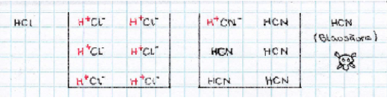
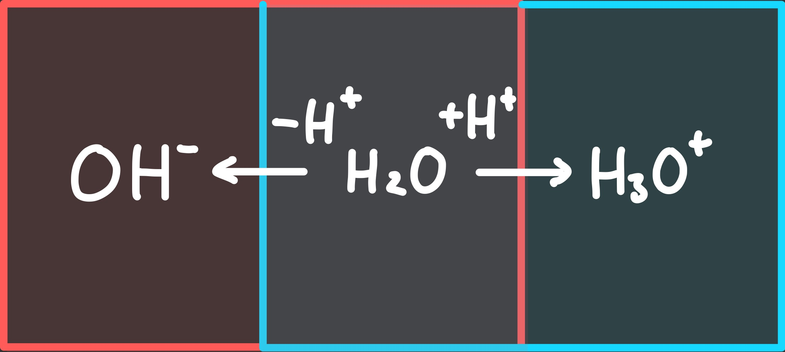

---
tags:
  - Chemie/Anorganisch
aliases:
  - Sauer
  - Säure
  - Säuren
  - basisch
subject:
  - chemie
created: 15th January 2026
title: Säuren und Basen
release: false
---

# Säuren Und Basen

Typische Säuren: $\rightarrow$ Sauer!

- $H$$Cl$ Salzsäure
- $H$$NO_{3}$ Salpetersäure
- $H$$_{2}SO_{4}$ Schwefelsäure  

 
Typische Basen: $\rightarrow$ fühlen sich seifig an!

- $Na$$OH$ Natronlauge
- $K$$OH$ Kalilauge  

## Arrhenius Theorie

Säuren sind Stoffe, die in wässriger Lösung die Wasserstoffionen -Konzentration ($H^{+}$-Ionen , Protonen) Konzentration **erhöhen**.  
Basen sind Stoffe, die in wässriger Lösung die Hydroxidionen -Konzentration ($OH^{-}$-Ionen) Konzentration **erhöhen**.

Der Nachteil dieser Theorie ist, dass Lösungsmittel Wasser sein muss und somit nicht allgemein anwendbar ist.

### Dissoziation (aufspalten, zerlegen)

$HCl\overset{H_{2}O}{\longrightarrow}H^{+}_{(aq.)}+Cl^{-}_{(aq.)}$  
Durch Wasser wird das $HCl$ [Molekül](Atombindung.md) in Ionen aufgespalten.

Hierbei werden beide Ionen von einer [Hydrathülle](https://studyflix.de/chemie/hydratation-2388) umschlossen. (aq.)  

### Neutralisation

Reaktion einer Säure mit einer Base, in deren Verlauf ein [Salz](Ionenbindung.md) und Wasser entstehen.  
$HCl+NaOH\longrightarrow NaCl+H_{2}O$  
exotherme Reaktion: es entsteht Neutralisationswärme

### Säuren und Basenstärke

Die Stärke einer Säure wird durch die $H^{+}$-Konzentration ausgedrückt, die sich in wässriger Lösung der Säure bei gegebener Konzentration einstellt.

Die Stärke einer Base wird durch die $OH^{-}$-Konzentration ausgedrückt, die sich in wässriger Lösung der Base bei gegebener Konzentration einstellt.

Starke Säuren sind mit Wasser vollständig dissoziiert.  
Schwache Säuren sind mit Wasser unvollständig dissoziiert.  

Dissoziationsgrad $\alpha = \dfrac{\text{Konz. der dissoziierten Moleküle}}{\text{Gesamte Konz. der Säure}}=\dfrac{C(A^{-})}{C(HA)}$  
$H\cdot A\leftrightarrows H^{+}+A^{-}$

### Reaktion Von Oxiden Mit $H_{2}O$

Nichtmetall-Oxide + $H_{2}O$ ergeben Säuren  
$CO_{2}+H_{2}O\longrightarrow \underbrace{H_{2}CO_{3}}_{\text{Kohlensäure}}\longrightarrow 2H^{+}_{(aq.)}+CO_{3(aq.)}^{2-}$  
$SO_{2}+H_{2}O\longrightarrow \underbrace{H_{2}SO_{3}}_{\text{schwefelige Säure}}\longrightarrow 2H^{+}_{(aq.)}+SO_{3(aq.)}^{2-}$

[Metall](Metallbindung.md)-Oxide + $H_{2}O$ ergeben Basen  
$Li_{2}O+H_{2}O\longrightarrow2LiOH\longrightarrow 2Li^{+}_{(aq.)} + 2OH^{-}_{(aq.)}$  
$MgO+H_{2}O\longrightarrow Mg(OH)_{2}\longrightarrow Mg^{2+}_{(aq.)}+2OH^{-}_{(aq.)}$

## Brønsted Theorie

Säuren sind Substanzen, die Protonen abgeben können.  
$\rightarrow$ Protonendonatoren ($H^{+}$-Geber)  
Basen sind Substanzen, die Protonen aufnehmen können.  
$\rightarrow$ Protonen Akzeptoren ($H^{+}$-Empfänger) 

### Protolyse

Chemische Reaktion, bei der ein Proton ($H^{+}$) zwischen zwei Reaktionspartnern übertragen wird.  
z.B. Reaktion einer Säure mit einer Base

#### Einleiten Von $HCl$-Gas in $H_{2}O$ (Säure + Wasser)

$\underbrace{HCl}_{\text{Säure}}+\underbrace{H_{2}O}_{\text{wirkt als Base}}\leftrightarrows \underbrace{H_{3}O^{+}}_{\text{Oxonium-Ion}}+\underbrace{Cl^{-}}_{\text{Chlorid-Ion}}$

**Allgemein:**  
$\underbrace{HA}_{\text{Säure}}+H_{2}O\leftrightarrows \underbrace{H_{3}O^{+}}_{\text{Oxonium-Ion}}+\underbrace{A^{-}}_{\text{Säure-Anion}}$

Wasser wirkt als Protonenakzeptor, also als Base 

#### Einleiten Von $NH_{3}$ in $H_{2}O$ (Base + Wasser)

$\underbrace{NH_{3}}_{\text{wirkt als Base}}+\underbrace{H_{2}O}_{\text{wirkt als Säure}}\leftrightarrows \underbrace{NH_{4}^{+}}_{\text{Ammonium-Ion}}+\underbrace{OH^{-}}_{\text{Hydroxid-Ion}}$

**Allgemein:**  
$\underbrace{B}_{\text{Base}}+H_{2}O \leftrightarrows \underbrace{BH^{+}}_{\text{Basen-Kation}}+\underbrace{OH^{-}}_{\text{Hydroxid-Ion}}$

Wasser wirkt als Protonendonator, also als Säure 

#### Ampholyt

Ein und derselbe Stoff wirkt je nach Reaktionspartner als Säure oder als Base.
>**$H_{2}O$:**  
>  
>$H_{2}O$ wirkt als Säure  
>$H_{2}O$ Wirkt als Base  
$H_{2}O$ ist ein Ampholyt und verhält sich amphoter

## Wichtige Säuren

| Name               |    Formel     |                 [Anion](Ionenbindung.md)                  | Name des Salzes / Anions                               | n-protonige Säure |
| ------------------ |:-------------:|:--------------------------------------------------------:| ------------------------------------------------------ |:-----------------:|
| Salzsäure          |     $HCl$     |                         $Cl^{-}$                         | Chlorid                                                |         1         |
| Flusssäure💀       |     $HF$      |                         $F^{-}$                          | Fluorid                                                |         1         |
| Salpetersäure      |   $HNO_{3}$   |                       $NO_{3}^{-}$                       | Nitrat                                                 |         1         |
| Salpetrige Säure⭐ |   $HNO_{2}$   |                       $NO_{2}^{-}$                       | Nitrit                                                 |         1         |
| Blausäure💀        |     $HCN$     |                         $CN^{-}$                         | Cyanid                                                 |         1         |
| Schwefelsäure      | $H_{2}SO_{4}$ |             $HSO_{4}^{-}$   $SO_{4}^{2-}$             | Hydrogensulfat   Sulfat                             |         2         |
| Schweflige Säure⭐ | $H_{2}SO_{3}$ |             $HSO_{3}^{-}$   $SO_{3}^{2-}$             | Hydrogensulfit   Sulfit                             |         2         |
| Kohlensäure        | $H_{2}CO_{3}$ |             $HCO_{3}^{-}$   $CO_{3}^{2-}$             | Hydrogencarbonat   Carbonat                         |         2         |
| Phosphorsäure      | $H_{3}PO_{4}$ | $H_{2}PO_{4}^{-}$   $HPO_{4}^{2-}$   $PO_{4}^{2-}$ | Dihydrogenphosphat   Hydrogenphosphat   Phosphat |         3         |

⭐:als Reinstoff nicht isolierbar

$HCL\longrightarrow H^{+}+Cl^{-}$  
 1x $H^{+}$

$H_{2}SO_{4}\longrightarrow H^{+}+HSO_{4}^{-}\longrightarrow 2H^{+}+SO_{4}^{2-}$  
2x $H^{+}$
 

## Wichtige Basen

Oxide der [Metalle](Metallbindung.md) reagieren mit $H_{2}O$ zu basischen Lösungen.  
$Na_{2}O+H_{2}O\longrightarrow 2NaOH\longrightarrow 2Na^{+}_{(aq.)}+2OH^{-}_{(aq.)}$

| Name(n)                                                | Formel       |
| ------------------------------------------------------ | ------------ |
| Natriumhydroxid, Natronlauge, Ätznatron(fest)          | $NaOH$       |
| Kaliumhydroxid, Kalilauge, Ätzkali(fest)               | $KOH$        |
| Calciumhydroxid, Kalklauge, Kalkmilch, Löschkalk(fest) | $Ca(OH)_{2}$ |
| Ammoniumhydroxid, Ammoniumlauge                        | $NH_{4}OH$   | 

## [Säure- und Basenkonstante](pH-Wert.md)

Bei schwachen Säuren existiert ein **Gleichgewicht** zwischen Ionen und den undissoziierten Molekülen (**Massenwirkungsgesetz**)  
$HA+H_{2}O\leftrightarrows H_{3}O^{+}+\underbrace{A^{-}}_{\text{Anion der Säure}}$  
$K_{a}=\dfrac{C(H_{3}O^{+})\cdot C(A^{-})}{C(HA)}$  
$K_{a}\dots$ Säurekonstante $\frac{mol}{L}$  
$C\dots$ Konzentration von $(\dots)$

**$K_{a}$ kann durch Messung der elektrischen Leitfähigkeit bestimmt werden**  
Säuren können somit nach ihrer Stärke eingeordnet werden  
$\underset{K_{a}=4\cdot10^{-10}}{HCL} < \underset{1.8\cdot10^{-5}}{\text{Essigsäure}} < \underset{4.5\cdot10^{-4}}{HNO_{2}}$

**Generell:** Die stärkere Säure verdrängt die schwächere aus ihrem Salz 
- $\underbrace{KCN}_{\text{Kaliumcyanid}}+HCl\longrightarrow HCN+KCl$
- $\underbrace{CaCO_{3}}_{\text{Kalk}}+2HCl\longrightarrow H_{2}CO_{3}+CaCl_{2}$

Analog zu den $K_{a}$-Werten der Säuren kann man $K_{b}$-Werte zuweisen.

$B+H_{2}O\leftrightarrows BH^{+}+OH^{-}$  
$K_{b}=\dfrac{C(BH^{+})\cdot C(OH^{-})}{C(B)}$  
$K_{b}\dots$ Basenkonstante $\frac{mol}{L}$  
$C\dots$ Konzentration von $(\dots)$

**Die** Säurekonstante $K_{a}$ **und die** Basenkonstante $K_{b}$ **sind ein Maß der Stärke einer Säure bzw. Base**

---

# Tags

[pH-Wert](pH-Wert.md)
