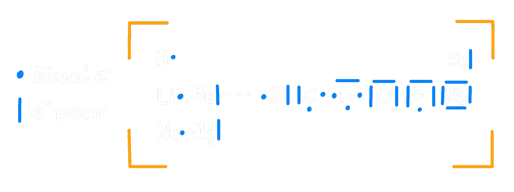

---
tags:
  - Chemie/Anorganisch
aliases:
  - Außenelektronen
  - Valenzen
  - Valenzelektron
  - Außenelektron
  - Valenzband
subject:
  - chemie
source:
  - Fritz Struber
created: 20th August 2022
---

# Valenzelektronen

- Elektronen der äußersten [Schale](Orbitalmodell.md) (**Außenelektronen**, Valenzband) eines Atoms.
- Sind für **chem. Verhalten** verantwortlich.
- Diese Elektronen können **Bindungen** (Valenzen) ausbilden. 
- Die zusammengezählten Hochzahlen der höchsten [Hauptquantenzahl](Orbitalmodell.md) ergeben die Anzahl an Valenzelektronen  

> [!example] z.B.:
> $$_{6}C\longrightarrow1s^{2}2s^{2}2p^{2} \begin{cases}
> \rightarrow 2+2=4 \text{ Außenelektronen}\\
> \rightarrow 4. \text{ Hauptgruppe}
> \end{cases}$$
> $$_{16}S\longrightarrow1s^{2}2s^{2}2p^{6}3s^{2}3p^{4}\begin{cases}
> \rightarrow 2+4=6 \text{ Außenelektronen}\\
> \rightarrow 6. \text{ Hauptgruppe}
> \end{cases}$$

Atome mit **Vollständig** (8) besetzten [Schalen](Orbitalmodell.md) sind **Reaktionsträge** ([Edelgase](https://de.wikipedia.org/wiki/Edelgase))
Alle anderen sind *mehr* oder *weniger* reaktiv.
Wie zu sehen entspricht die Anzahl der Valenzelektronen einer Hauptgruppe im [PSE](Periodensystem%20der%20Elemente.md).

## Schreibweise Für Außenelektronen

Beispiel diverser Atome in der Anordnung des [PSE](Periodensystem%20der%20Elemente.md)

---
# Tags
