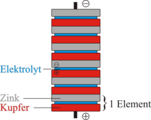

---
tags:
  - Chemie/Elektrochemie/Primärelement
aliases:
created: 15th January 2026
title: Voltasche Säule
release: false
---

# Voltasche Säule

$Zn$ - Zink  
$Cu$ - Kupfer
$H_{2}SO_{4}$ - Salzsäure (Elektrolyt)