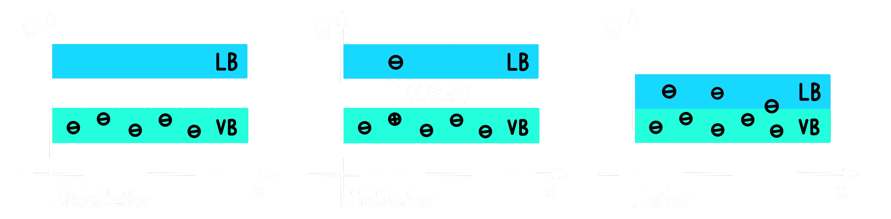

# Elektrische Leitfähigkeit

- Leiter, Halbleiter, Isolator
- Elektr. Leiter 1. Klasse ([Metalle](Metallbindung.md)) $\rightarrow$ Elektronen als Ladungsträger
- Elektr. Leiter 2. Klasse (gelöstes oder geschmolzenes [Salz](Ionenbindung.md)) $\rightarrow$ Ionen als Ladungsträger

## Bandstruktur

> siehe [Halbleiterphysik](../Physik/Halbleiterphysik.md)

> [!success] Valenz (VB) und Leitungsband (LB)

Energieabstände der Bänder (Bandgap, $W_{g}\to$ g ... gap)

- Nichtleiter: $W_{g}>3eV$
- Halbleiter: $W_{g}\approx1.12$
- Leiter: $W_{g} = 0$

---

# Related

- [The Actual Reason Semiconductors Are Different From Conductors and Insulators. - YouTube](https://www.youtube.com/watch?v=-lHXZk5M6cI)
- [Why It Was Almost Impossible to Make the Blue LED - YouTube](https://www.youtube.com/watch?v=AF8d72mA41M)