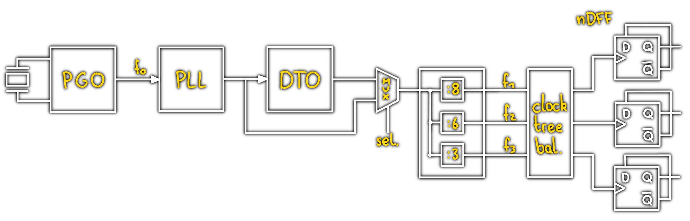

---
tags:
  - MCU
  - Baugruppe/Oszillator
aliases:
  - Clock
subject:
  - hwe
created: 17th October 2022
title: Clock-Generierung
---

# Clock Generierung

Ein Oszillator ist eine elektrische Schaltung, welche eine ungedämpfte, elektrische Schwingung mit konstanter Frequenz und Amplitude erzeugt.

> [!note] Blockschaltbild eines komplexen Taktsystems  
> 
> 
> 
> [PGO](Pierce-Gate%20Oszillator.md) | [PLL](Phase%20Locked%20Loop.md) | [Discrete Time Oscillator](../../Digital-Design/Discrete%20Time%20Oscillator.md) | [Clock Divider](../../Digital-Design/Clock%20Divider.md) | [Clock Tree Balancing](../../Digital-Design/Clock%20Tree%20Balancing.md)

---

# Tags

[Clock_und_Reset_Generierung](../_assets/pdf/Clock_und_Reset_Generierung.pdf)