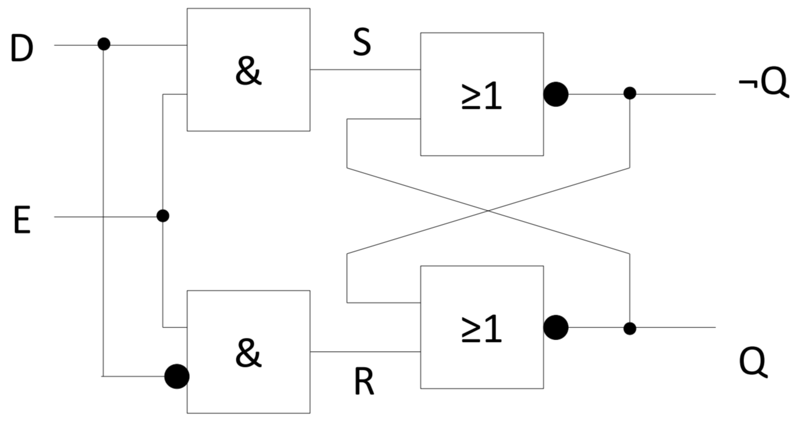
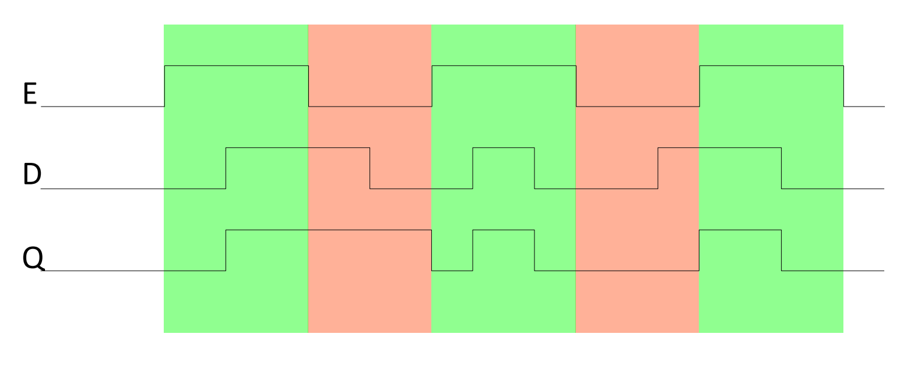

---
tags:
aliases:
subject:
  - VL
  - Rechnerarchitektur
semester: SS26
created: 15th April 2026
professor:
release: false
title: D-Flip Flop
---

# D-Flip Flop

> [!question] [Sequenzielle Logik](Sequenzielle%20Logik.md)

S und R werden aus D berechnet

$$
S = D,\quad R = ¬D
$$

Enable steuert die Datenübernahme ([AND als Tor](Grundgatter.md#AND%20als%20Tor))

- Das D-Latch heißt *transparent*, wenn das Schreibsignal $E$ aktiv ist
- E muss lange genug aktiv sein, damit sich der neue Zustand im RS-FF einstellen kann
- Das D-Latch ist pulsgesteuert (Schreibpuls E)
- Einfache 1-Bit Speicherzelle

## Taktflankengesteuertes D-FF

Taktflankengesteuerte Flipflops, wie das D-Flipflop (D-FF), übernehmen Daten
zu einem bestimmten Zeitpunkt (kein transparenter Modus!), nämlich bei der
steigenden Flanke des sog. Clocksignals (Taktflanke)

Daten müssen lediglich bei der steigenden Taktflanke stabil sein
(zzgl. Setup- und Holdzeit)

> [!info] Funktionsweise:
> 
> Das D-FF ließt den aktuellen Wert von D bei steigender Clockflanke
> 
> - Wenn CLK von 0 nach 1: D wird weitergegeben zu Q
> - Sonst behält Q seinen vorherigen Wert

## Timing

D Darf sich wärend dem Sampling nicht ändern.

### Zeitanforderung an die Eingangssignale

- **Setup-Zeit** $t_{\mathrm{setup}}$: Zeitfenster *vor Taktflanke* in dem $D$ *stabil* anliegen muss
- **Hold-Zeit** $t_{\mathrm{hold}}$: Zeitfenster *nach Taktflanke* in dem $D$ *stabil* anliegen muss
- **Abtastzeit** $t_{\mathrm{a}}$: Zeitfenster *um Taktflanke herum* in dem $D$ *stabil* anliegen muss

$$
t_{\mathrm{a}} = t_{\mathrm{setup}} + t_{\mathrm{hold}}
$$

|  | |
| - | - |

### Zeitanforderung an die Ausgangssignale

**Kontaminationsverzögerung** (contamination delay) $t_{\mathrm{ccq}}$: Zeitfenster nach Taktflanke, nach dem Q beginnen kann sich zu ändern.

**Laufzeitverzögerung** (progation delay) $t_{\mathrm{pcq}}$: Zeitfenster nach Taktflanke, nach dem Q garantiert stabil ist.

> *cq*: *C*LK nach *Q*

|  | |
| - | - |

