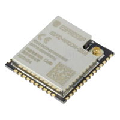

---
tags:
  - index
title: esp32
release: false
aliases:
  - ESP32
  - Espressif
---


# ESP32

 Der ESP32 ist ein Leistungsstarkes RISC-V Mikrokontroller mit einem Dual-Core 32-bit Xtensa LX6 Prozessor des chinesischen Herstellers Espressif, welcher oft aufgrund seiner Vielzahl an Funktionseinheiten, Protokollen und Sensorschnittstellen, im Internet of Things (IoT) Verwendung findet. Integrierte [Schnittstellen](../Interfaces/index.md) sind beispielsweise [UART](../Interfaces/UART.md), [SPI](../Interfaces/SPI.md), CAN, [I2C](../Interfaces/I2C.md), I2S, WLAN und Bluetooth.


 Für Prototypen sind ESP32-WROOM Module, halbfertige [PCB](../../Analog-Design/PCB-Layout.md)-Module mit gekerbten Löchern als Pins, üblich. Module unterscheiden sich grundlegend im Footprint, welcher durch die Art der [Antenne](../../HF-Technik/Antenne.md), PIF-[Antenne](../../HF-Technik/Antenne.md) oder IPX/UFL Connector, bestimmt ist. Eine vom Footprint unabhängige Kenngröße, ist die Größe des Flash-Memory.


Um den ESP32 programmieren zu können, muss zuerst die Firmware ([ESP-AT](../../Softwareentwicklung/IoT/ESP-AT.md)) auf den Chip heruntergeladen werden.

# Firmware Entwicklung

Für die SW-Entwicklung sind verschiedene Entwicklungsplattformen gängig, unter Anderen das SDK von Espressif ([ESP-IDF](../../Softwareentwicklung/IoT/ESP-IDF.md)) oder aber Arduino. In dieser Anleitung wird die Arduino-Variante ausgewählt (ist die einfachere für den Einstieg).

- als Editor wird VSCode verwendet
- für die Toolkette wird [Python](../../Softwareentwicklung/Python/Python.md) benötigt
- für die Entwicklung von µController-Software gibt's die Extension [PlatformIO](../PlatformIO.md)

(Beschreibung: <https://randomnerdtutorials.com/vs-code-platformio-ide-esp32-esp8266-arduino/)>

## Allgemein

In VSCode kann ein Projekt gestartet werden:

- VSCode -> [Platformio](../PlatformIO.md) -> Home-Open -> New Project
- Auswahl Board: **ESP32 Pico Kit (Espressif)**.
- Framework: Arduino

Die *Projektkonfiguration* wird in der Datei platformio.ini abgelegt und hat hauptsächlich diesen Inhalt:

```ini
[env:pico32]
platform = espressif32
board = pico32
framework = arduino
monitor_speed= 115200       ; Communication via Serial-Monitor
```

Zum Hinzufügen zusätzlicher Libraries zum Projekt, können diese direkt in der Konfiguration `platfromio.ini` angegeben oder mittels [PlatformIO](../PlatformIO.md) eingefügt werden (VSCode -> Platfomio -> Libraries ->…).

PlatformIO speichert Bibliotheken und Konfigurationen üblicherweise unter `C:\Users\xxxxxxxx\.platformio` (Windows).

**HTL-Board:**

Das ESP32-SG-Board (HTL-ESP32) ist bestückt mit:
- ESP32-Pico
- 4 LEDs - Ports IO14 (RTC_GPIO16), IO27 (RTC_GPIO17), IO32 (RTC_GPIO9), IO33 (RTC_GPIO8).
- 3 Schalter - Ports IO13 (RTC_GPIO14), IO15 (RTC_GPIO13), IO25 (GPIO25) 

Die DigitalIO-Konfiguration kann mittels dieser *Defines* abgebildet werden:

```
#define PORT_LED0 14
#define PORT_LED1 27
#define PORT_LED2 32
#define PORT_LED3 33

#define PORT_SW4 15
#define PORT_SW3 13
#define PORT_SW2 25
```

Serial-Monitor - Setup Baudrate und Ausgabe (Arduino.h):

```cpp
Serial.begin(115200);
Serial.println("Hello from ESP32");
```

## ESP32 Beispiele

Im Folgenden sind ein paar Beispiel-Sourcen für notwendige Funktionalitäten.

- [ESP32-SwitchBlink](ESP32-SwitchBlink.md)
- [ESP32-WiFi](ESP32-WiFi.md)
- [ESP32-WebServer](ESP32-WebServer.md)
- [ESP32-Bluetooth](ESP32-Bluetooth.md)
- [ESP32-MQTT](ESP32-MQTT.md)
- [ESP32-I2C](ESP32-I2C.md)
- [ESP32-JSON](ESP32-JSON.md)
- [ESP32-DeepSleepTimer](ESP32-DeepSleepTimer.md)

# Troubleshooting

- **Programmieren nicht möglich**. Es kann vorkommen, dass eine Kommunikation mit dem ESP32 via SerialMonitor möglich ist, ein Programmieren allerdings nicht. Dann muss während dem Start der Programmierung der Boot-Button gedrückt gehalten werden bis die Programmierung startet (siehe <https://randomnerdtutorials.com/esp32-troubleshooting-guide/> Pkt. 4).

# Referenzen

µController ESP32-Pico
- [Link-Espressif ESP32-Pico](https://docs.espressif.com/projects/esp-idf/en/latest/esp32/hw-reference/esp32/get-started-pico-kit.html#)
- [ESP32-Pico Getting Started](../../_assets/pdf/Esp32Pico/Espressif_Systems_01162019_ESP32-PICO-KIT-1523019.pdf)
- [ESP32-Pico Technical Reference Manual](../../_assets/pdf/Esp32Pico/esp32_technical_reference_manual_en.pdf)
- [ESP32-Pico Datasheet](../../_assets/pdf/Esp32Pico/esp32-pico-d4_datasheet_en.pdf)
- [ESP32-Pico Schematic](../../_assets/pdf/Esp32Pico/esp32-pico-kit-v4.1_schematic.pdf)


Arduino-Framework
- <https://www.arduino.cc/reference/en/libraries/>


Setup/Installation ESP32 Projekte mit Arduino-Framework auf PlatformIO
- <https://randomnerdtutorials.com/vs-code-platformio-ide-esp32-esp8266-arduino/>


Setup/Installation ESP-IDF mit PlatformIO
- [PIO-Debugging](https://docs.platformio.org/en/latest/tutorials/espressif32/espidf_debugging_unit_testing_analysis.html#tutorial-espressif32-espidf-debugging-unit-testing-analysis)
- [PIO-ESPIDF](https://docs.platformio.org/en/latest/frameworks/espidf.html)
