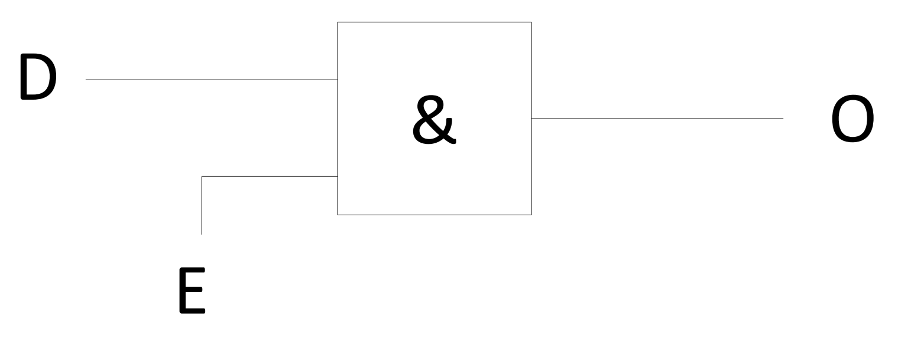

---
tags:
aliases:
  - Logikgatter
  - Gatter
keywords:
  - AND
  - OR
  - XOR
  - NOT
  - Wahrheitstabelle
  - Schaltsymbole
subject:
  - KV
  - Technische Informatik
semester: WS24
created: 14. Oktober 2024
professor:
title: Grundgatter
release: false
---

# Grundgatter

Logikgatter dienen zur Realiserung von Logischer Funktionen.

---

$a$ und $b$ sind Eingänge und $y$ der Ausgang des jeweiligen Gatters.

| Gatter | Ausdruck | 
| ------ | ------------------------------------------------------------------ |
| AND    | $y=a\cdot b$                                                       |
| NAND   | $y=\neg(a\cdot b)$                                            |
| OR     | $y=a+b$                                                            |
| NOR    | $y=\neg(a + b)$                                               |
| Buffer | $y=a$                                                              |
| NOT    | $y = \neg a$                                                      |
| XOR    | $y = a\oplus b = (\neg a\cdot b) + (a \cdot \neg b)$             |
| XNOR   | $y = \neg(a\oplus b) = (\neg a \cdot \neg b) + (a \cdot b)$ |

- $a, b, \neg a, \neg b, y$ sind [Logische Literale](Logische%20Literale.md) aus der [booleschen Algebra](../Mathematik/Algebra/Boolesche%20Algebra.md)

## AND

### AND als Tor

Und-Gatter kann wie ein „Tor“ interpretiert werden

- Ein Dateneingang
- Ein Steuereingang (Enable)

- Steuereingang=1: Dateneingang wird auf Ausgang durchgelassen
- Steuereingang=0: Dateneingang wird nicht durchgelassen

 ---

# Tags

- [Sequenzielle Logik](Sequenzielle%20Logik.md)
- [Kombinatorische Logik](Kombinatorische%20Logik.md)