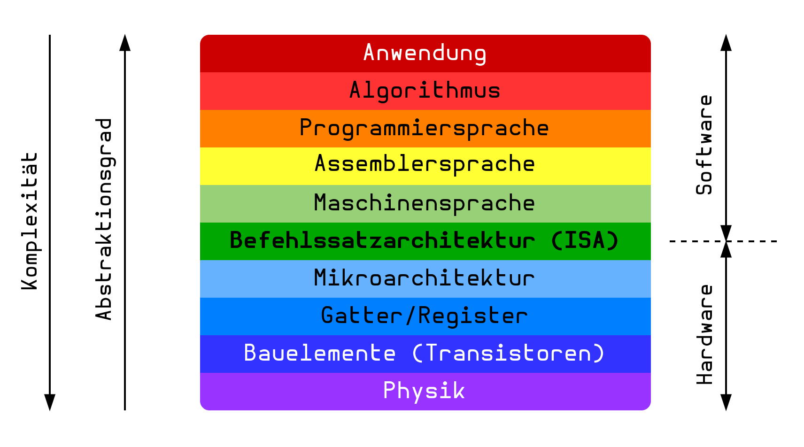

---
tags:
  - Architektur
aliases:
  - ISA
  - Architektur
  - Rechnerarchitektur
keywords:
subject:
  - VL
  - Rechnerarchitektur
semester: SS25
created: 12th March 2025
professor:
release: false
title: Assembly
---
 

# Architekturen - Assembler

**Ebenensicht:**

Letzte Lesbare Sprachebene. Meistens sind die Befehle elementare Operationen
- add, sub, mul, load, store ...

> [!important] **Register:** Register stehen zur Datenmanipulation und speicherung zur Verfügung
> - Parallele D-FlipFlops
> - Register haben keinen Typen, es werdenu die Bits gespeichert
> - Operationen legen fest, wie das Register interpretiert wird. (Floating point operationen ...)

| Assembler                                      | Höhere Programmiersprache                                                                                                        |
| ---------------------------------------------- | -------------------------------------------------------------------------------------------------------------------------------- |
| Zusammenhänge von operationen schwer erkennbar | Gute Lesbarkeit                                                                                                                  |
| Einfache Befehle                               | Komplexe Sprachkonstrukte                                                                                                        |
| Direkter Speicherzugriff                       | Implementiert selbst Memory Management oder ein abstraktes Interface dafür. (Garbage Collector, [Heap](../Softwareentwicklung/DS-Algo/Heap.md), Ownership/Borrowing) |

## Instructionset Architecture

ISA: Instructionset Architecture ([ARM](ARM.md), x86, RISC-V)

---

- [RV-Assembly](RISC-V.md#RV-Assembly)
- [x86-Assembly](x86-Assembly.md)
- [ARM-Assembly](ARM.md)