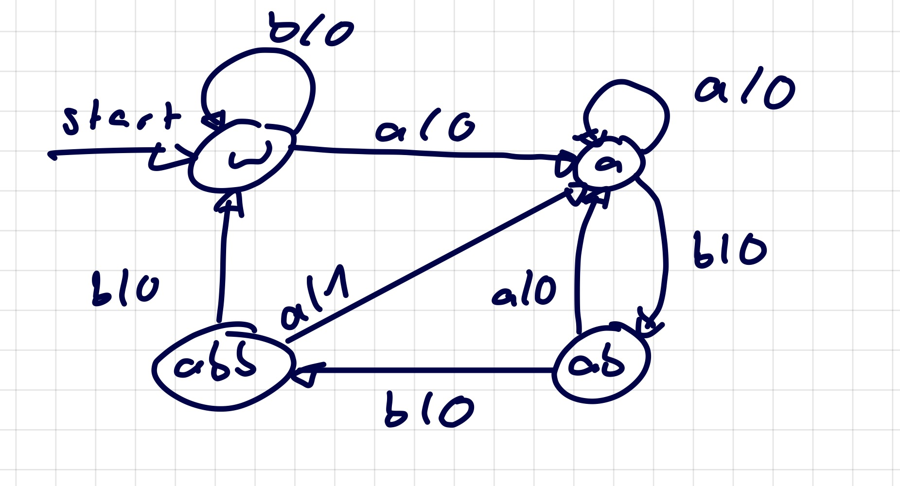
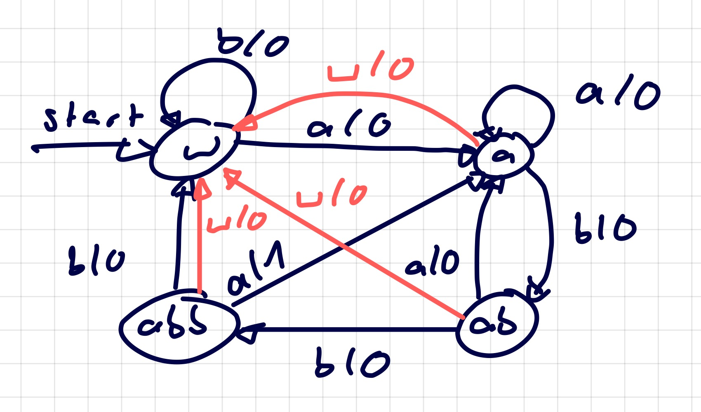
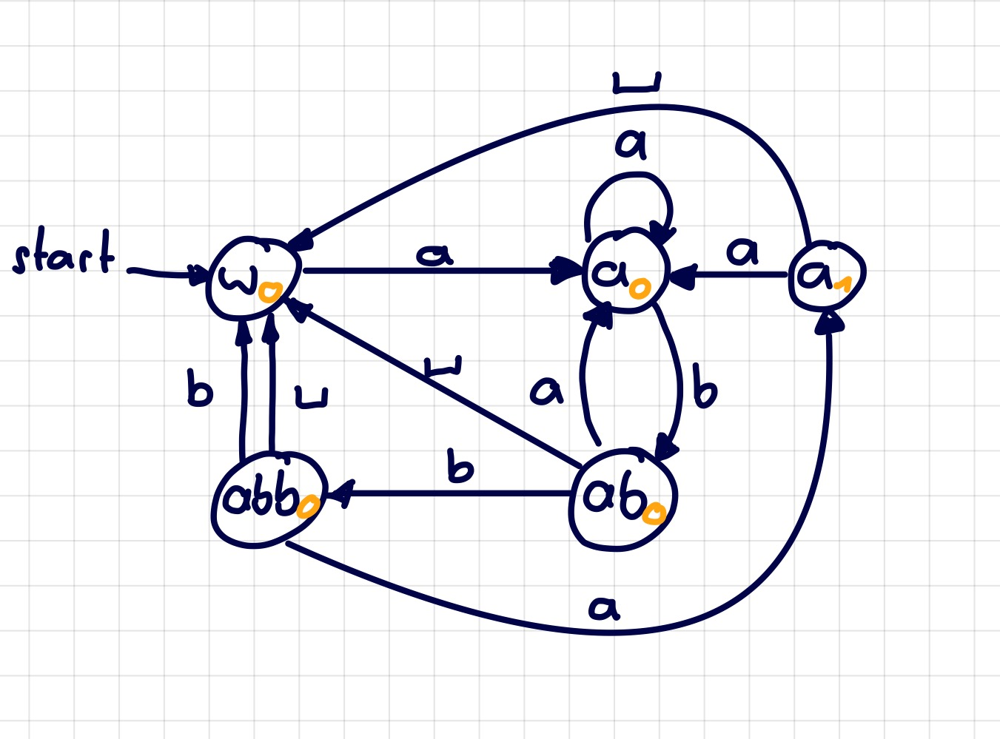

 

# Automatentheorie

## Mealy Automat

> [!INFO] Der Wert steht am Pfeil

$$
\begin{align}
o(t)&= \lambda (s(t)) \\
s(t+1) &= \delta(i(t),s(t))
\end{align}
$$

### Entwicklung von Mealy-Automaten

>[!EXAMPLE] Erkennung von Folge: abba $\to$ Lampe geht an  
> Input: ababbbaabbabbaaababbaabbb  

> 
> Erweitern mit Leerzeichen:  

### Mealy-Moore Transformation

## Moore Automat