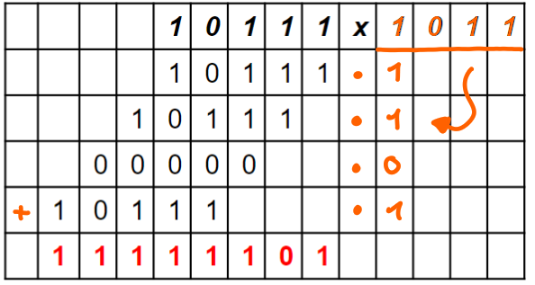

---
tags:
  - Algebra
aliases:
  - Binär
keywords:
subject:
  - VL
  - Technische Informatik
semester: WS23
created: 15th May 2025
professor:
  - Timm Ostermann
title: Dualsystem
draft: false
---

# Dualsystem

Das Dualsystem ist ein [Polyadisches Stellenwertsystem](Polyadisches%20Stellenwertsystem.md) mit Radix 2

## Darstellung negativer Zahlen

1. Signed Magnitude
2. Komplement Darstellung
	1. Einser- / r-1-Komplement
	2. Zweiter- / r-2-Komplement

**Überblick**

| Dezmial | 2er Komplement | 1er Komplement  | Signed-Magnitude |
| ------- | -------------- | --------------- | ---------------- |
| $-8$    | $1000$         | -               | -                |
| $-7$    | $1001$         | $1000$          | $1111$           |
| $-6$    | $1010$         | $1001$          | $1110$           |
| $-5$    | $1011$         | $1010$          | $1101$           |
| $-4$    | $1100$         | $1011$          | $1100$           |
| $-3$    | $1101$         | $1100$          | $1011$           |
| $-2$    | $1110$         | $1101$          | $1010$           |
| $-1$    | $1111$         | $1110$          | $1001$           |
| $0$     | $0000$         | $0000$ / $1111$ | $0000$ / $1111$  |
| $1$     | $0001$         | $0001$          | $0001$           |
| $1$     | $0010$         | $0010$          | $0010$           |
| $3$     | $0011$         | $0011$          | $0011$           |
| $4$     | $0100$         | $0100$          | $0100$           |
| $5$     | $0101$         | $0101$          | $0101$           |
| $6$     | $0110$         | $0110$          | $0110$           |
| $7$     | $0111$         | $0111$          | $0111$           |

### Signed magnitude

Darstellung der $0$

- $+0_{10} = 0000_{\mathrm{sm}2}$
- $-0_{10} = 1000_{\mathrm{sm}2}$

Man verschwendet also zwei Stellen für die $0$.

> [!example]- Beispiele
> 
> | $r=\mathrm{sm}2$ | $r=10$             |     | $r=10$             | $r=\mathrm{sm}_{2}$ |
> | ---------------- | ------------------ | --- | ------------------ | ------------------- |
> | $1111$           | $-7$               |     | $\color{orange}+0$ | $0000$              |
> | $1110$           | $-6$               |     | $+1$               | $0001$              |
> | $1101$           | $-5$               |     | $+2$               | $0010$              |
> | $1100$           | $-4$               |     | $+3$               | $0011$              |
> | $1011$           | $-3$               |     | $+4$               | $0100$              |
> | $1010$           | $-2$               |     | $+5$               | $0101$              |
> | $1001$           | $-1$               |     | $+6$               | $0110$              |
> | $1000$           | $\color{orange}-0$ |     | $+7$               | $0111$              |
> 
> $$
> \begin{align}
> +14_{10} &= 01110_{\mathrm{sm}2} \\
> -14_{10} &= -(1110)_{2} = 11110_{\mathrm{sm}2}
> \end{align}
> $$

### 2er Komplement

Das $r$-Komplement des Dualsystems ist das **2er Komplement**, $r=2$.

Das 2er Komplement ist schwieriger zu bilden aber leichter zu rechnen (einfach Übertrag entfernen).

- Jede $1$ zu $0$, jede $0$ zur $1$
- Jede $1$ zu $0$, jede $0$ zur $1$
- und $+1$

**Bildung des 2er Komplements**

Beispiel:

| $N_{r=10}$ | $N_{r=2}$           | $(r=2)^{(n=3)} - N_{(r=10)}$ | $\overline{N_{r=2}}$ | $\overline{N_{r=10}}$ |
| :----------: | :-------------------: | :----------------------------: | :--------------------: | :---------------------: |
| $0_{10}$   | $000$               | $8-0=8$                      | $1000$               | $+8_{10}$             |
| $1_{10}$   | $001$               | $8-1=7$                      | $111$                | $-1_{10}$             |
| $2_{10}$   | $010$               | $8-2=6$                      | $110$                | $-2_{10}$             |
| $3_{10}$   | $011$               | $8-3=5$                      | $101$                | $-3_{10}$             |
| $4_{10}$   | $\color{orange}100$ | $8-4=4$                      | $\color{orange}100$  | $-4_{10}$             |

Man Beachte dass nicht der gesamte Wertebereich verwendet werden kann, da z.B. für $n=3: -4_{10}=4_{10}$. Der Wertebereich des Radix Komplements ist daher

$$ [r^{n-1}-1, -r^{n-1}] $$

#### 1er Komplement 

Das $r-1$-Komplement des Dualsystems ist das **1er Komplement**, da $r=2$.

1er Komplement ist leichter zu bilden, aber schwieriger zu rechnen

- Jede $1$ zu $0$, jede $0$ zur $1$
- Jede $1$ zu $0$, jede $0$ zur $1$

## Rechnen im Dualsystem

### Subtraktion

>[!example] $9.5_{10}-4_{10}$
> 
> $$
> \begin{aligned}
> 9.5_{10} &\hat{=} 1001.1_{2} \\
> 4_{10} &\hat{=}0100_{2} \\
> r-1:-4_{10}&\hat{=}1011_{1K} \\
> r: -4_{10}&\hat{=}1100_{2K} \\
> \end{aligned}
> \quad \implies \quad
> \begin{aligned}
> &1001.1 \\
> +&\underline{1100} \\
> \cancel{ 1 }~&0101.1 \hat{=} 5.5
> \end{aligned}
> $$
> 
> Beim Rechnen mit 2K kann der übertrag danach entfernt werden, um die richtige Zahl zu erhalten 

### Multiplikation

> [!example] **Add & Shift**
> 
> 

