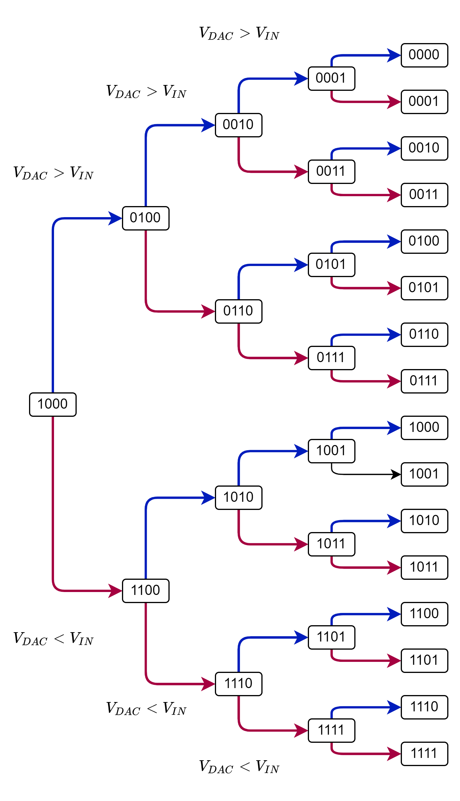

---
tags:
  - Digital/ADC
aliases:
  - Successive Approximation Register ADC
  - SAR
created: 22. Dezember 2023
---

# Successive Approximation Register ADC

> [!question] Wägeverfahren

Wie in Abbildung 1 zu sehen ist, wird für den Aufbau des SAR-ADCs eine [Filter](../Hardwareentwicklung/Filter-Verstärker/Filter.md)-Baugruppe benötigt. In diesem Aufbau wird der [Filter](../Hardwareentwicklung/Filter-Verstärker/Filter.md) durch ein [RC-Glied](../Hardwareentwicklung/Filter-Verstärker/Filter.md) realisiert.

|   |
|---|
|Abbildung 1: Aufbau des SAR-ADCs|

## Algorithums

# Quellen

-WS23/ELIT%20PR/AnalogeDigitaleST/Protokoll_ELIT-PR_ADST_k12136610.pdf)