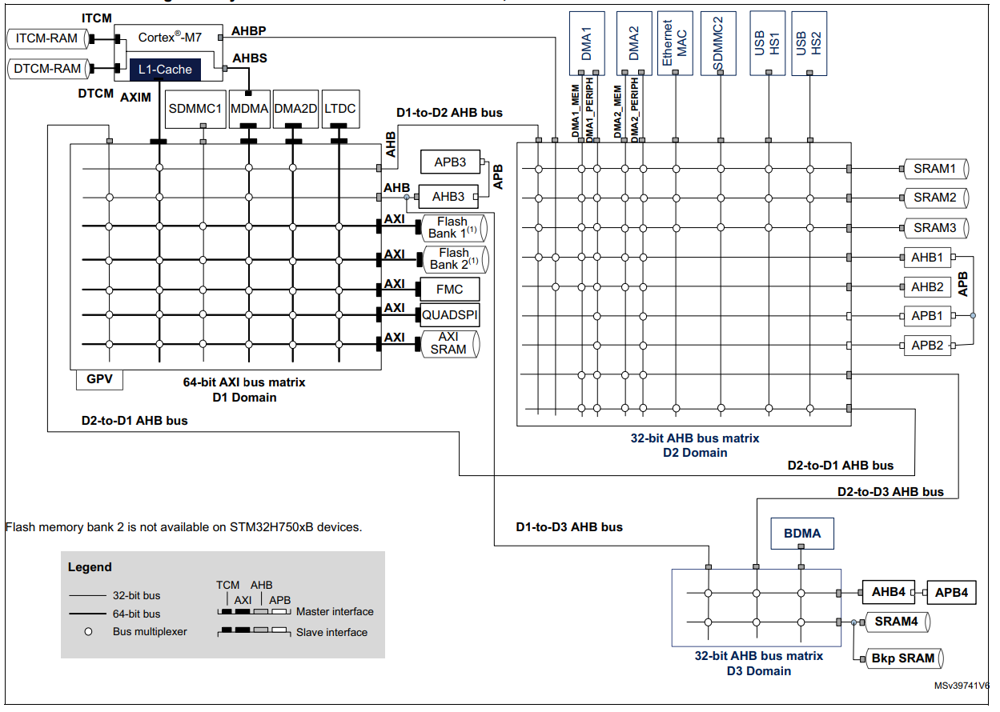

---
tags:
  - linker
aliases:
created: 22. Juni 2024
---

# Enable DMA for STM32

The DTCM and ITCM (data and instruction tightly coupled RAMs) are connected through dedicated TCM buses directly to the Cortex-M7 core.

Only the Master DMA controller can access the DTCM and ITCM through AHBS but **not** DMA1 or DMA2. 

The connection could still be achieved through a detour over the Inter-Domain Bus D1-to-D2 AHB Bus but introduces undesired latency. The memory for DMA-Controlled Operations is therefore Outsourced to the SRAM1. 



---

Disable globally Dcache for CORTEX_M7.

> [!question]- Explanation
> The CPU contains two internal caches, I-Cache for loading instructions and D-Cache for data. The D-Cache can affect the functionality of DMA transfers, since it will hold the new data in the internal cache and do not write them to the SRAM memory. However, the DMA controller loads the data from SRAM memory and not D-Cache. Therefore, the D-Cache has to be disabled.

---

Replace DTCMRAM with RAM_D1 for the following sections in STM32H743XIHx_FLASH.Id file
- .data
- .bss
- .\_user_heap_stack

> [!multi-column]
>
> ```ld title='Example: Before'
> .data : 
> {
>   . = ALIGN(4);
>   _sdata = .;        /* create a global symbol at data start */
>   *(.data)           /* .data sections */
>   *(.data*)          /* .data* sections */
> 
>   . = ALIGN(4);
>   _edata = .;        /* define a global symbol at data end */
> } >DTCMRAM AT> FLASH
> ```
>
> ```ld title='Example: After'
> .data : 
> {
>   . = ALIGN(4);
>   _sdata = .;        /* create a global symbol at data start */
>   *(.data)           /* .data sections */
>   *(.data*)          /* .data* sections */
> 
>   . = ALIGN(4);
>   _edata = .;        /* define a global symbol at data end */
> } >RAM_D1 AT> FLASH
> ```

> [!question]- Explanation
> 

--- 

Remove/Comment the line `\_estack = 0x20020000`

> [!question]- Explanation
> the `_estack` field contains the address for the *end of the stack*.
> 
> The Memory address `0x20020000` is composed with the *origin* plus the *length* of the DTCMRAM (Data Tightly Coupled Random Accesss Memory)
> 

---

Add this line in `.\_user_heap_stack` section:

`_estack = .;`

after`. = . + _Min_Stack_Size;`
and before `. = ALIGN(8);`

```ld
._user_heap_stack :
{
  . = ALIGN(8);
  PROVIDE ( end = . );
  PROVIDE ( _end = . );
  . = . + _Min_Heap_Size;
  . = . + _Min_Stack_Size;
  _estack = .; /* <<<< line added */
  . = ALIGN(8);
} >RAM_D1
```

> [!question]- Explanation
> 