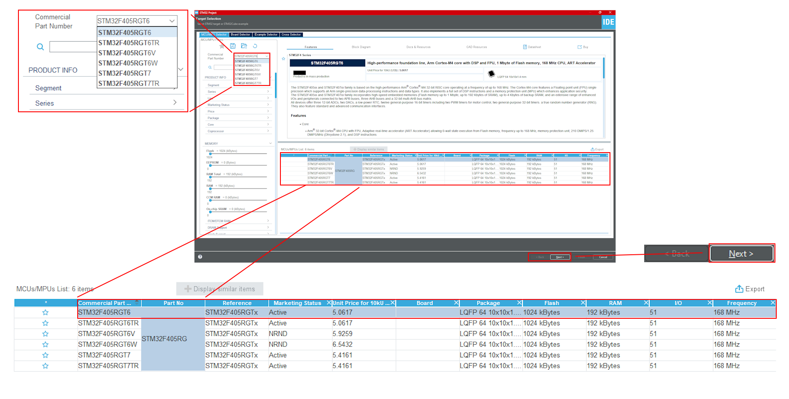
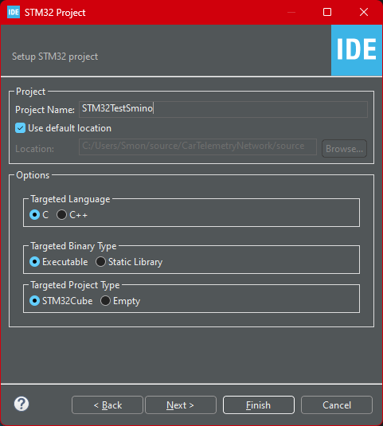

---
tags:
  - MCU
  - MCU/STM32
  - MCU/STM32/HAL
  - MCU/STM32/LL
aliases:
  - STMCubeIDE
  - STMicroelectronics
  - "#MCU/STM32"
created: 18th August 2023
---

# Getting Started

## Projekt Setup in STMCubeIDE

> [!info]- Projektdatei Erstellen
> 
> 

> [!info]- MCU Auswählen (Hier *STM32F405RGT6*)
> Nach dem Erstellen der Projektdatei öffnet sich der ***MCU-Selector***
> 
> 
> 
> Hier kann entweder direkt nach einer Part-Nummer gesucht werden, oder nach Eigenschaften und Peripherien gefiltert werden.

> [!info]- Projektoptionen und Fertigstellung
> 
> 
> 
> Für den Einstig können hier die Standardeinstellungen verwendet werden.
>
> *Targeted Language:* Grundsätzlich ist für STM32 Projekte die Programmiersprache C empfohlen. Habe ich zwar nicht selbst ausprobiert, aber für [C++](../Softwareentwicklung/Cpp/{MOC}%20Cpp.md) soll es anscheinend Probleme mit dem HAL geben.
> 
> *Executable:* Das Programm ist auf dem MCU Ausführbar.
> 
> Anschließend mit *Finish* das Projekt Setup beenden.

## STLink Programmer

[STLink V2](https://www.st.com/resource/en/user_manual/um1075-stlinkv2-incircuit-debuggerprogrammer-for-stm8-and-stm32-stmicroelectronics.pdf)

## Requirements

STMCubeIDE
[STLink Server](https://www.st.com/en/development-tools/st-link-server.html)

## Guide