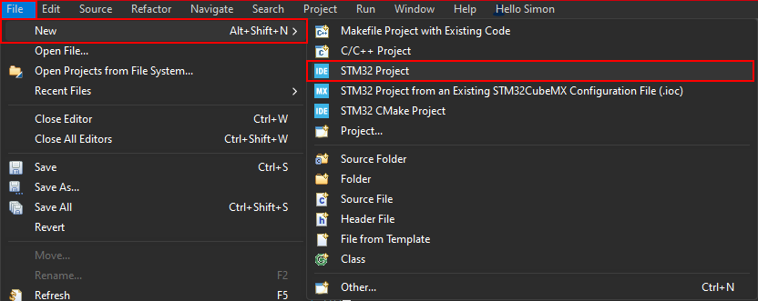

# STM32

## Projekt Setup in STMCubeIDE

> [!info]- Projektdatei Erstellen

> [!info]- MCU Auswählen (Hier *STM32F405RGT6*)
> Nach dem Erstellen der Projektdatei öffnet sich der ***MCU-Selector***
> Hier kann entweder direkt nach einer 
> 

## Requirements

STMCubeIDE
[STLink Server](https://www.st.com/en/development-tools/st-link-server.html)
