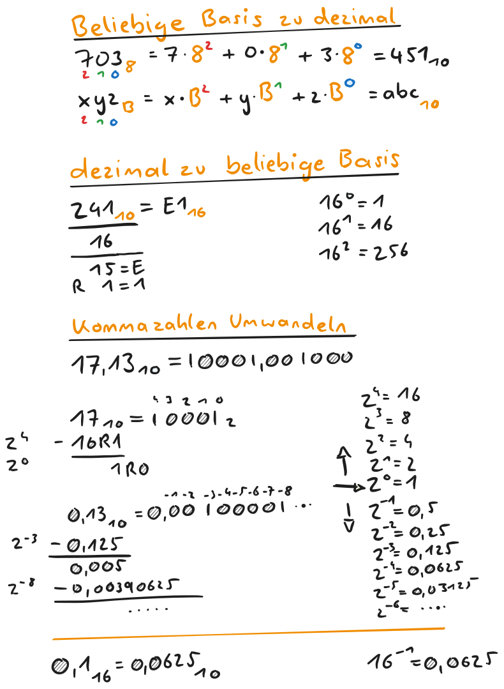

---
tags:
  - IT
aliases:
  - Stellenwertsystem
  - polyadisch
keywords:
  - Stellenwertsystem
  - Polyadische Systeme
  - Komplementär Darstellung
subject:
  - KV
  - Technische Informatik
semester: WS23
created: 3. Oktober 2023
professor:
  - Timm Ostermann
---
 

# Zahlensysteme

Stellenwertsystem (Positionssystem)

- Zahlen werden durch Ziffern dargestellt.
- Die Wertigkeit einer Ziffer hängt von der jeweiligen Stelle ab.

Wichtigste Stellenwertsysteme sind polyadische Systeme 
 
- Zahlen werden mit einer Potenzreihe dargestellt 
- $1\cdot 10^1+1\cdot 10^2\dots$ (hier: Dezimalsystm)

Beispiele für nicht polyadische Zahlensysteme  
- Zeit Skala - Stellenwertsystem aber nicht polyadisch  
- röm. Zahlensystem - Additionssystem, kein Stellenwertsystem

## Polyadisches Stellenwertsystem

> [!def] **D - PYAD)** Polyadisches Stellenwertsystem
>
> $$N=(a_{n-1} a_{n-2} \dots a_{1} a_{0}, a_{-1} a_{-2}\dots a_{-m})_{r}$$  

- $N\dots$ Zahl
- $a_{i}\dots$ Ziffern  
- $r\dots$ Radix, Basis (2 binär, 10 dezimal, 16 hexadezimal…)  
- $,\dots$ Komma/Radixpunkt - Trennung zwischen ganzzahligem und gebrochenem Teil
- $a_{n-1}$ MSD - most significant digit
- $a_{-m}$ LSD - least significant digit

> [!example] Beispiele
>
> - Dezimalsystem ($345 = 3\cdot 10^2+4\cdot 10^1+5\cdot 10^0$)
> - [Dualsystem](Dualsystem.md) ($10110=1\cdot 2^{4}+0\cdot 2^{3}+1\cdot 2^{2}+1\cdot 2^1 +0\cdot 2^0$)
> - Oktalsystem (…)
> - Hexadezimal (…)
> 

| Basis   | Dezimal $r=10$               | Dual $r=2$                               | Oktal $r=8$                  | Hexadezimal $r=16$           |
| ------- | ---------------------------- | ---------------------------------------- | ---------------------------- | ---------------------------- |
| Ziffern | $0-9$                        | $0,1$                                    | $0-7$                        | $0-9,A-F$                    |
|         | $0$ $1$ $2$ $3$     | $00000$ $00001$ $00010$ $00011$ | $0$ $1$ $2$ $3$     | $0$ $1$ $2$ $3$     |
|         | $4$ $5$ $6$ $7$     | $00100$ $00101$ $00110$ $00111$ | $4$ $5$ $6$ $7$     | $4$ $5$ $6$ $7$     |
|         | $8$ $9$ $10$ $11$   | $01000$ $01001$ $01010$ $01011$ | $10$ $11$ $12$ $13$ | $8$ $9$ $A$ $B$     |
|         | $12$ $13$ $14$ $15$ | $01100$ $01101$ $01110$ $01111$ | $14$ $15$ $16$ $17$ | $C$ $D$ $E$ $F$     |
|         | $16$ $17$ $18$ $19$ | $10000$ $10001$ $10010$ $10011$ | $20$ $21$ $22$ $23$ | $10$ $11$ $12$ $13$ |

## Konvertieren in Zahlensysteme

