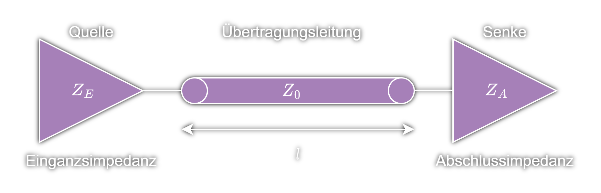

---
tags:
  - RF
aliases:
  - Anpassung
  - anpassen
  - Anpassnetzwerk
  - Admittanz
subject:
  - hwe
  - ksn
source:
  - ""
created: 11th April 2023
---

# Impedanz

$$
\begin{align}
Z = R+jX\\
Y = G+jB
\end{align}
$$

| $Z$ | *Impedanz*   Scheinwiderstand | $\uparrow^{-1}$ | $Y$ | *Admittanz*   Scheinleitwert |
| --- | -------------------------------- | --------------- | --- | ------------------------------- |
| $R$ | *Resistanz*   Wirkwiderstand  | $\uparrow^{-1}$ | $G$ | *Konduktanz*   Wirkleitwert  |
| $X$ | *Reaktanz*    Blindwiderstand | $\uparrow^{-1}$ | $B$ | *Suszeptanz*   Blindleitwert |

## Impedanzanpassung

### Anpassnetzwerk

### $\frac{\lambda}{4}$-Transformator

$$Z_{E}\cdot Z_{A}=Z_{L}^{2}$$

> [!SUMMARY] Herleitung (Verlustlose [[Leitun](../HF-Technik/Leitungstheorie.md)g](../HF-Technik/Leitungstheorie.md))  
> $Z_{E} = Z_{A}\cdot \dfrac{1+j \frac{Z_{L}}{Z_{A}}\tan(\beta \cdot l_{e})}{1+ j\frac{Z_{A}}{Z_{L}}\tan(\beta \cdot l_{e})} \qquad  \beta \cdot l_{e} = \dfrac{2\pi}{\lambda}\cdot \dfrac{\lambda}{4}= \dfrac{\pi}{2}$  
> $\tan$ ist an der Stelle $\frac{\pi}{2}$ singulär $\to$ *$Z_{E}=\dfrac{Z_{L}^{2}}{Z_{A}}$* bzw. *$Z_{E} = Z_{A}\cdot Z_{L}^{2}$*

### Abschlussimpedanz

> [!IMPORTANT] Für hochfrequente [Logik](../Mathe/Aussagenlogik.md)-Signale ([elektrisch kurz](../HF-Technik/Leitungstheorie.md) im vergleich zur Flankenanstiegszeit) führen Fehlanpassungen an einer der Impedanzen $Z_{S}$, $Z_{0}$ bzw. $Z_{L}$ zu [Reflexionen](../HF-Technik/Reflexionsfaktor.md).  
> Probleme:
> - Overshoot oder Undershoot durch [Reflexionen](../HF-Technik/Reflexionsfaktor.md)
> - Signalintegritätsprobleme ([SI](Signalintegrität.md)) ([Logik](../Mathe/Aussagenlogik.md)-Schwellen, Überschreitung von maximum ratings)
> - Probleme mit [EMV](Elektromagnetische%20Verträglichkeit.md) (erhöhte Frequenzanteile, Abstrahlungen)

> [!INFO] Eine Anpassung der [Leitungstheorie](../HF-Technik/Leitungstheorie.md) unterdrückt diese Probleme  
> [Leitungen](../HF-Technik/Leitungstheorie.md) können länger sein  
> Die Datenrate kann erhöht werden  
> Bessere [SI](Signalintegrität.md) und [EMC](Elektromagnetische%20Verträglichkeit.md)

> [!WARNING] Es gibt verschiedene Arten von Abschlussanpassung:
> - Seriell (Widerstand am Ausgang der Quelle (Treiber))
> - [Parallel](Parallel%20Termination.md) (Widerstand parallel zur Senke, Verbunden mit einer *Terminationvoltage* oder Masse)
> - weitere: AC parallel, Thevenin, [Diode](Halbleiter/Diode.md)

# Tags

[Induktivitäten](Induktivitäten.md)

[Kapazität](Kapazität.md)

