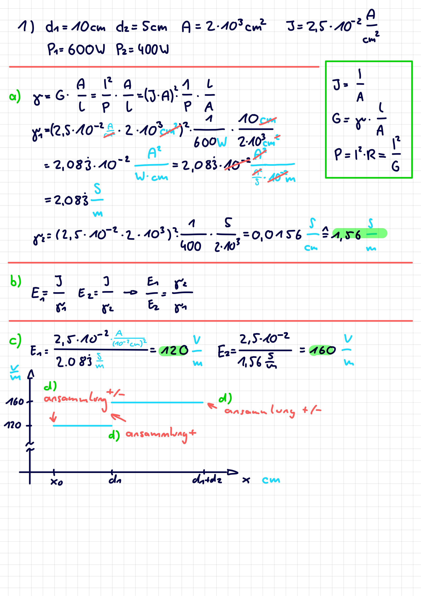
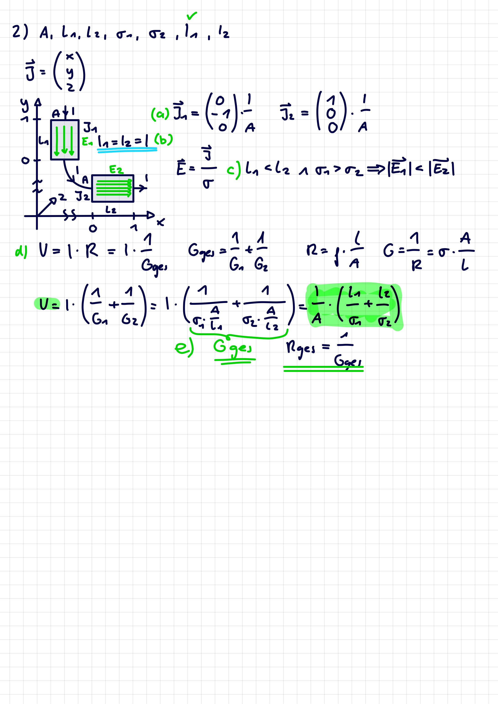

 

# Statisches E-Feld

> [!INFO] Statisch:  
> es änderst sich nichts mehr (eingeschwungener Zustand)

Ähnlich wie das Schwerefeld einer Masse, kann auch einer einzelnen Ladung ein elektrisches Feld $E$ zugeordnet werden. Die Kraft auf eine Ladung 𝑞, die in dieses Feld eingebracht wird ergibt sich dann aus

$$
\vec{F}=q\cdot \vec{E}
$$

Das Feld das eine Ladung $Q$ um sich herum erzeugt ist, ähnlich wie beim Schwerefeld mit sternförmig auseinander gehenden Feldlinien verknüpft und mit mit dem Quadrat des Abstandes ab; sein [Betrag](../Mathe/Betrag.md) reduziert sich mit dem Quadrat des Abstands zu dieser Ladung:

$$
|\vec{E}| = \frac{Q}{4\pi\varepsilon_{0}r^{2}}
$$

Die Einheit der elektrischen Feldstärke ist $1 \frac{V}{m}$.

## Feldstärke in einem Leiter

$$
\begin{align}
&\vec{E} = \frac{\vec{J}}{\sigma}=\vec{J}\cdot \rho
\end{align}
$$

## Potenzielle Energie im elektrischen Feld

# Beispiele

> [!EXAMPLE]- Stromfluss in Leitern  
> 
>
> > [!SUCCESS]- Lösung  
> > 

> [!EXAMPLE]- Stromfluss in Leitern 2  
> 
>
> > [!SUCCESS]- Lösung  
> > 
