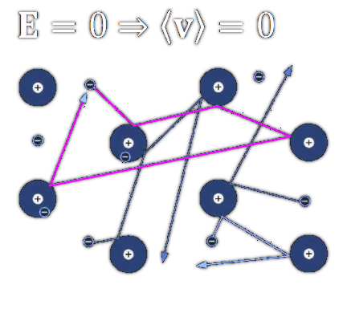
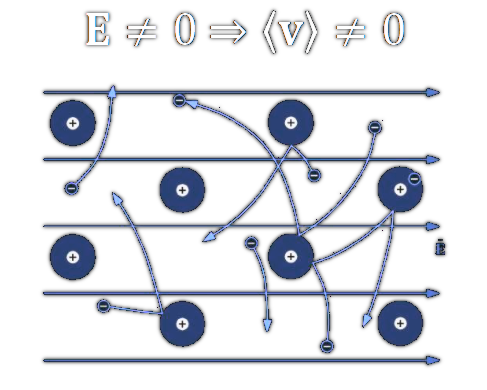
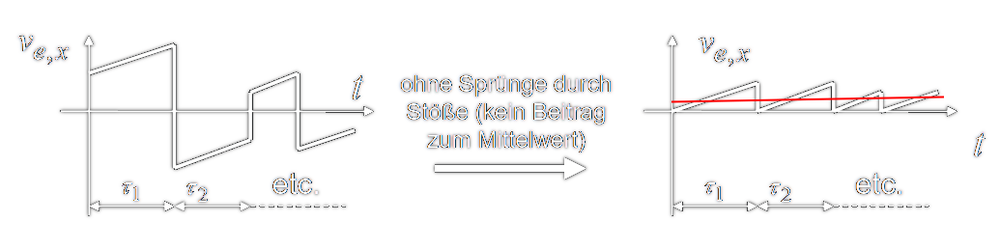

 

# Drude-Modell - Modell für den elektrischen [Strom](../Elektrotechnik/elektrischer%20Strom.md)

> [!info] Das Drude-Modell beschäftigt sich mit dem [Ladungstransport in einem Leiter](elektrischer%20Strom.md), der durch ein [elektrisches Feld](elektrisches%20Feld.md) hervorgerufen wird.
> Gemäß einer statistischen Betrachtung, kann die mittlere Geschwindigkeit von Ladungsträgern in einem Leiter unter Einfluss eines Feldes durch die material und temperaturabhängige **Beweglichkeit** $\mu_{e}$ beschrieben werden:

$$\left\langle\vec{v}_e\right\rangle=-\frac{e \uptau}{m_e} \vec{E}=-\mu_e \vec{E} $$

Die Mittlere Driftgeschwindigkeit $\langle v\rangle$ der Elektronen im [Metall](../Chemie/Metallbindung.md) ist ohne einem [elektrischen Feld](elektrisches%20Feld.md) im Mittel Null.
Obwohl sich die Elektronen individuell betrachtet durch die [thermische](../Physik/Temperatur%20und%20Teilchenmodell.md) Wimmelbewegung **sehr** schnell bewegen. Die Streuung der Elektronen ist *isotrop* [^1].

Da in einem konstanten [Elektrischen Feld](elektrisches%20Feld.md) auf ein Elektron die [Coulomb-Kraft](Coulomb-Kraft.md) $-e\cdot \vec{E}$ wirkt und *massebehaftete* Körper (also auch Elektronen) unter Einfluss einer [Kraft](../Physik/{MOC}%20Kräfte.md) beschleunigen, müssten alle Elektronen unter Einfluss dieses E-Feldes in negative Richtung beschleunigen.

> [!warning] Unter Annahme eines konstanten Feldes $\mathbf{E}$ würde ein Elektron mit der Kraft $-e\cdot\mathbf{E}$ beschleunigt.
> Tatsächlich stellt sich aber eine mittlere Driftgeschwindigkeit 𝐯 ein, die in erster Näherung proportional zu 𝐄 ist.
> Der Grund liegt in der Wechselwirkung (Stößen) mit dem Gitter.

## Beweglichkeit $\mu_{e}$- Zusammenhang mit mittlerer Flugzeit

- Thermische Bewegung eines Elektrons in x-Richtung (ohne [elektrisches Feld](elektrisches%20Feld.md)). Mit jedem Stoß Streuung in zufällige Richtung, Mittelwert der [Geschwindigkeit](../Physik/Kinematik.md) $\langle v_{e,x} \rangle = 0$

Die Gesamtheit der Stöße der Elektronen wird als *Streuung* bezeichnet

Die [thermische](../Physik/Temperatur%20und%20Teilchenmodell.md) Wimmelbewegung wird mit der Beschleunigung durch das [E-Feld](elektrisches%20Feld.md) überlagert.

Da die [thermische](../Physik/Temperatur%20und%20Teilchenmodell.md) Wimmelbewegung der Elektronen *sehr viel größer* ist als die Geschwindigkeitszunahme durch das elektrische Feld, kann man die [Thermische](../Physik/Temperatur%20und%20Teilchenmodell.md) Bewegung immer noch als *isotrop* Betrachten.

> [!success] $\left\langle\vec{v}_e\right\rangle=-\dfrac{e \uptau}{m_e} \vec{E}=-\mu_e \vec{E}$
> 
> - $\langle v_{e} \rangle$ … Mittlere Geschwindigkeit der Elektronen
> - $-e$ … [Ladung](elektrisches%20Feld.md) eines Elektrons (negative [Elementarladung](../Physik/Konstanten/Elementarladung.md))
> - $\uptau$ … Mittlere Stoßzeit
> - $m_{e}$ … Masse eines Elektrons
> - $\vec{E}$ … [Elektrische Feldstärke](elektrisches%20Feld.md)
> 
> $\mu_{e}$ wird als Beweglichkeit bezeichnet.

[^1]: **Isotrop:** Liefert keinen Betrag zum Mittelwert und ist im Mittel $0$.