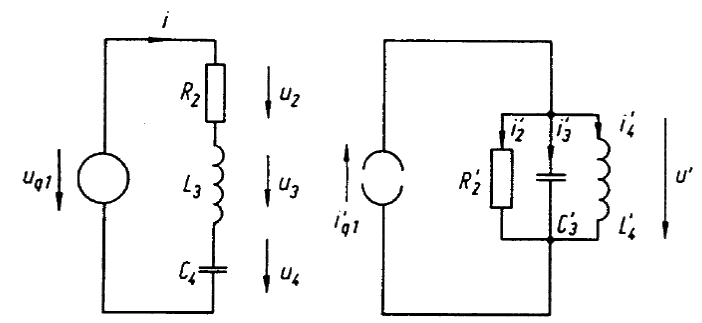

---
tags:
  - Baugruppen/Oszillator
aliases: 
keywords: 
subject:
  - VL
  - Elektrotechnik
semester: SS24
created: 24. Januar 2024
professor:
  - Andreas Springer
cited:
---
 

# Elektrische Schwingungen

> [!info] elementare [Schwingkreise](../Physik/Schwingkreise.md)
> Serienschwingkreis
> [Parallelschwingkreis](Parallelschwingkreis.md)

## Schwingkreise als duale Zweipole

# Tags

/assets/Schwingkreise%202024-01-17%2009.08.32.excalidraw)